# Proposed changes to ISO/IEC 14496-22 (Amendment 2)

Changes to the following sections of ISO/IEC 14496-22:2019 Open Font Format
(OFF) are proposed:

- [4.3 Data types](#changes-to-off-43-data-types)
- [5.7.11 COLR – Color Table](#changes-to-off-5711---color-table)
- [5.7.12 CPAL – Palette Table](#changes-to-off-5712---palette-table)
- [7.2.1 Overview (Font variations common table formats)](#changes-to-off-721-overview-font-variations-common-table-formats)
- [7.2.3 Item variation stores](#changes-to-off-723-item-variation-stores)
- [Bibliography](#changes-to-off-bibliography)

## Changes to OFF 4.3 Data types

_Replace the table defining data types with the following (added row for Offset24):_

| Data Types | Description |
|-|-|
| uint8 | 8-bit unsigned integer. |
| int8 | 8-bit signed integer. |
| uint16 | 16-bit unsigned integer. |
| int16 | 16-bit signed integer. |
| uint24 | 24-bit unsigned integer. |
| uint32 | 32-bit unsigned integer. |
| int32 | 32-bit signed integer. |
| Fixed | 32-bit signed fixed-point number (16.16) |
| FWORD | int16 that describes a quantity in font design units. |
| UFWORD | uint16 that describes a quantity in font design units. |
| F2DOT14 | 16-bit signed fixed number with the low 14 bits of fraction (2.14). |
| LONGDATETIME | Date and time represented in number of seconds since 12:00 midnight, January 1, 1904. The value is represented as a signed 64-bit integer. |
| Tag | Array of four uint8s (length = 32 bits) used to identify a table, design-variation axis, script, language system, feature, or baseline |
| Offset16 | Short offset to a table, same as uint16, NULL offset = 0x0000 |
| Offset24 | 24-bit offset to a table, same as uint24, NULL offset = 0x000000 |
| Offset32 | Long offset to a table, same as uint32, NULL offset = 0x00000000 |

## Changes to OFF 5.7.11 - Color Table

_Replace the content of clause 5.7.11 with the following:_

The COLR table adds support for multi-colored glyphs in a manner that integrates
with the rasterizers of existing text engines and that is designed to be easy to
support with current OpenType font files.

The COLR table defines color presentations for glyphs. The color presentation of
a glyph is specified as a graphic composition using other glyphs, such as a
layered arrangement of glyphs, each with a different color. The term “color
glyph” is used informally to refer to such a graphic composition defined in the
COLR table; and the term “base glyph” is used to refer to a glyph for which a
color glyph is provided. Processing of the COLR table is done on glyph sequences
after text layout processing is completed and prior to final presentation of
glyphs. Typically, a base glyph is a glyph that may occur in a sequence that
results from the text layout process. In some cases, a base glyph may be a
virtual glyph defined within this table as a re-usable color composition.

For example, the Unicode character U+1F600 is the grinning face emoji. Suppose
in an emoji font the 'cmap' table maps U+1F600 to glyph ID 718. Assuming no
glyph substitutions, glyph ID 718 would be considered the base glyph. Suppose
the COLR table has data describing a color presentation for this using a layered
arrangement of other glyphs with different colors assigned: that description and
its presentation result would be considered the corresponding color glyph.

Two versions of the COLR table are defined.

Version 0 allows for a simple composition of colored elements: a linear sequence
of glyphs that are stacked vertically as layers in bottom-up z-order. Each layer
combines a glyph outline from the &#39;glyf&#39;, CFF or CFF2 table (referenced
by glyph ID) with a solid color fill. These capabilities are sufficient to
define color glyphs such as those illustrated in figure 5.6.


**Figure 5.6 Examples of the graphic capabilities of COLR version 0**

Version 1 supports additional graphic capabilities. In addition to solid colors,
gradient fills can be used, as well as more complex fills using other graphic
operations, including affine transformations and various blending modes. Version
1 capabilities allow for color glyphs such as those illustrated in figure 5.7:


**Figure 5.7 Examples of the graphic capabilities of COLR version 1**

Version 1 also extends capabilities in variable fonts. A COLR version 0 table
can be used in variable fonts with glyph outlines being variable, but no other
aspect of the color composition being variable. In version 1, all of the new
constructs for which it could be relevant have been designed to be variable; for
example, the placement of color stops in a gradient, or the alpha values applied
to colors. The graphic capabilities supported in version 0 and in version 1 are
described in more detail below.

The COLR table is used in combination with the CPAL table (5.7.12): all color
values are specified as entries in color palettes defined in the CPAL table. If
the COLR table is present in a font but no CPAL table exists, then the COLR
table is ignored.

**5.7.11.1 Graphic Compositions**

The graphic compositions in a color glyph definition use a set of 2D graphic
concepts and constructs:

* Shapes (or *geometries*)
* Fills (or *shadings*)
* Layering—a *z-order*—of elements
* Composition and blending modes—different ways that the content of a layer is
combined with the content of layers above or below it
* Affine transformations

For both version 0 and version 1, shapes are obtained from glyph outlines in the
&#39;glyf&#39;, &#39;CFF &#39; or CFF2 table, referenced by glyph ID. Colors
used in fills are obtained from the CPAL table.

The simplest color glyphs use just a few of the concepts above: shapes, solid
color fills, and layering. This is the set of capabilities provided by version 0
of the COLR table. In version 0, a base glyph record specifies the color glyph
for a given base glyph as a sequence of layers. Each layer is specified in a
layer record and has a shape (a glyph ID) and a solid color fill (a CPAL palette
entry). The filled shapes in the layer stack are composed using only alpha
blending.

Figure 5.8 illustrates the version 0 capabilities: three shapes are in a layered
stack: a blue square in the bottom layer, an opaque green circle in the next
layer, and a red triangle with some transparency in the top layer.


**Figure 5.8 Basic graphic capabilities of COLR version 0**

The basic concepts also apply to color glyphs defined using the version 1
formats: shapes are arranged in layers and have fills. But the additional
formats of version 1 support much richer capabilities. In a version 1 color
glyph, graphic constructs and capabilities are represented primarily in *Paint*
tables, which are linked together in a *directed, acyclic graph*. Several
different Paint formats are defined, each describing a particular type of
graphic operation:

* A PaintColrLayers table provides a layering structure used for creating a
color glyph from layered elements. A PaintColrLayers table can be used at the
root of the graph, providing a base layering structure for the entire color
glyph definition. A PaintColrLayers table can also be nested within the graph,
providing a set of layers to define some graphic sub-component within the color
glyph.

* The PaintSolid, PaintLinearGradient, PaintRadialGradient, and
PaintSweepGradient tables provide basic fills, using color entries from the CPAL
table.

* The PaintGlyph table provides glyph outlines as the basic shapes.

* The PaintTransform table is used to apply an affine transformation matrix to
a sub-graph of paint tables, and the graphic operations they represent. The
PaintTranslate, PaintRotate and PaintSkew tables support specific
transformations.

* The PaintComposite table supports alternate compositing and blending modes for
two sub-graphs.

* The PaintColrGlyph table allows a color glyph definition, referenced by a base
glyph ID, to be re-used as a sub-graph within multiple color glyphs.

In a simple color glyph description, a PaintGlyph table might be linked to a
PaintSolid table, for example, representing a glyph outline filled using a basic
solid color fill. But the PaintGlyph table could instead be linked to a much
more complex sub-graph of Paint tables, representing a shape that gets filled
using the more-complex set of operations described by the sub-graph of Paint
tables.

The graphic capabilities are described in more detail in 5.7.11.1.1 –
5.7.11.1.9. The formats used for each are specified 5.7.11.2.

**5.7.11.1.1 Colors and solid color fills**

All colors are specified as a base zero index into CPAL (5.7.12) palette
entries. A font can define alternate palettes in its CPAL table; it is up to the
application to determine which palette is used. A palette entry index value of
0xFFFF is a special case indicating that the text foreground color (defined by
the application) should be used, and shall not be treated as an actual index
into the CPAL ColorRecord array.

The CPAL color data includes alpha information, as well as RGB values. In the
COLR version 0 formats, a color reference is made in LayerRecord as a palette
entry index alone. In the formats added for COLR version 1, a color reference is
made in a ColorIndex record, which includes a palette entry index and a separate
alpha value. Separation of alpha from palette entries in version 1 allows use of
transparency in a color glyph definition independent of the choice of palette.
The alpha value in the ColorIndex record is multiplied into the alpha value
given in the CPAL color entry.

In version 1, a solid color fill is specified using a PaintSolid table. See
5.7.11.1.3 for details on how a PaintSolid fill is applied to a shape.

**5.7.11.1.2 Gradients**

COLR version 1 supports three types of gradients: linear gradients, radial
gradients, and sweep gradients. Each type of gradient is defined using a color
line.

**5.7.11.1.2.1 Color Lines**

A color line is a function that maps real numbers to color values to define a
one-dimensional gradation of colors, to be used in the definition of linear,
radial, or sweep gradients. A color line is defined as a set of one or more
color stops, each of which maps a particular real number to a specific color.

On its own, a color line has no positioning, orientation or size within a design
grid. The definition of a linear, radial, or sweep gradient will reference a
color line and map it onto the design grid by specifying positions in the design
grid that correspond to the real values 0 and 1 in the color line. The
specification for linear, radial and sweep gradients also include rules for
where to draw interpolated colors of the color line, following from the
placement of 0 and 1.

A color stop is defined by a real number, the *stop offset*, and a color. A
color line is defined with at least one color stop within the interval [0, 1].
Additional color stops can be specified within or outside the interval [0, 1].
(Stop offsets are represented using F2DOT14 values, therefore color stops can
only be specified within the range [-2, 2). See 5.7.11.2.4 for format details.)
If only one color stop is specified, that color is used for the entire color
line; at least two color stops are needed to create color gradation.

Color gradation is defined over the interval from the first color stop, through
the successive color stops, to the last color stop. Between adjacent color
stops, color values are linearly interpolated. See _Interpolation of Colors_ in
5.7.12 for requirements on how colors are interpolated.

If there are multiple color stops defined for the same stop offset, the first
one is used for computing color values on the color line below that stop offset,
and the last one is used for computing color values at or above that stop
offset. All other color stops for that stop offset are ignored.

While the color gradation is specified over a defined interval, the color line
continues indefinitely outside that interval in both directions. The color
pattern outside the defined interval is repeated according to the color line’s
*extend mode*. Three extend modes are supported:

* **Pad:** outside the defined interval, the color of the closest color stop is
used. Using a sequence of letters as an analogy, given a sequence “ABC”, it is
extended to “…*AA* ABC *CC*…”.

* **Repeat:** The color line is repeated over repeated multiples of the defined
interval. For example, if color stops are specified for defined interval of [0,
0.7], then the pattern is repeated above the defined interval for intervals
[0.7, 1.4], [1.4, 2.1], etc.; and also repeated below the defined interval for
intervals [-0.7, 0], [-1.4, -0.7], etc. In each repeated interval, the first
color is that of the farthest defined color stop. By analogy, given a sequence
“ABC”, it is extended to “…*ABC* ABC *ABC*…”.

* **Reflect:** The color line is repeated over repeated intervals, as for the repeat
mode. However, in each repeated interval, the ordering of color stops is the
reverse of the adjacent interval. By analogy, given a sequence “ABC”, it is
extended to “…*ABC CBA* ABC *CBA ABC*…”.

Figures 5.9 – 5.11 illustrate the different color line extend modes. The figures
show the color line extended over a limited interval, but the extension is
unbounded in either direction.


**Figure 5.9 Color gradation extended using pad mode**


**Figure 5.10 Color gradation extended using repeat mode**


**Figure 5.11 Color gradation extended using reflect mode**

NOTE: The extend modes are the same as the [spreadMethod][31] attribute used for
linear and radial gradients in the [Scalable Vector Graphics (SVG) 1.1 (Second
Edition)][32] specification.

When combining a color line with the geometry of a particular gradient
definition, one might want to achieve a certain number of repetitions of the
gradient pattern over a particular geometric range. Assuming that geometric
range will correspond to placement of stop offsets 0 and 1, the following steps
can be used:

* In order to get a certain number of repetitions of the gradient pattern
(without reflection), divide 1 by the number of desired repetitions, use the
result as the maximum stop offset for specified color stops, and set the extend
mode to *repeat*.
* In order to get a certain number of repetitions of the
reflected gradient pattern, divide 1 by two times the number of desired
repetitions, use the result as the maximum stop offset for specified color
stops, and set the extend mode to *reflect*.

NOTE: Sweep gradients have special considerations in relation to color line
extend modes and do not support repetition of gradient patterns. See
5.7.11.1.2.4 for details.

**5.7.11.1.2.2 Linear gradients**

A linear gradient provides gradation of colors along a straight line. The
gradient is defined by three points, p₀, p₁ and p₂, plus a color line. The color
line is positioned in the design grid with stop offset 0 aligned to p₀ and stop
offset 1.0 aligned to p₁. (The line passing through p₀ and p₁ will be referred
to as line p₀p₁.) Colors at each position on line p₀p₁ are interpolated using
the color line. For each position along line p₀p₁, the color at that position is
projected on other side of the line.

The additional point, p₂, is used to rotate the gradient orientation in the
space on either side of the line p₀p₁. The line passing through points p₀ and p₂
(line p₀p₂) determines the direction in which colors are projected on either
side of the color line. That is, for each position on line p₀p₁, the line that
passes through that position on line p₀p₁ and that is parallel to line p₀p₂ will
have the color for that position on line p₀p₁.

NOTE: For convenience, point p₂ can be referred to as the _rotation point_, and
the vector from p₀ to p₂ can be referred to as the _rotation vector_. However,
neither the magnitude nor direction of the vector (from p₀ to p₂, versus from p₂
to p₀) has significance.

If either point p₁ or p₂ is the same as point p₀, the gradient is ill-formed and
shall not be rendered. 

If line p₀p₂ is parallel to line p₀p₁ (or near-parallel for an
implementation-determined definition), then the gradient is ill-formed and shall
not be rendered.

NOTE: An implementation can derive a single vector, from p₀ to a point p₃, by
computing the orthogonal projection of the vector from p₀ to p₁ onto a line
perpendicular to line p₀p₂ and passing through p₀ to obtain point p₃. The linear
gradient defined using p₀, p₁ and p₂ as described above is functionally
equivalent to a linear gradient defined by aligning stop offset 0 to p₀ and
aligning stop offset 1.0 to p₃, with each color projecting on either side of
that line in a perpendicular direction. This specification uses three points,
p₀, p₁ and p₂, as that provides greater flexibility in controlling the placement
and rotation of the gradient, as well as variations thereof.

Figures 5.12 – 5.14 illustrate linear gradients using the three different color
line extend modes. Each figure illustrates linear gradients with two different
rotation vectors. In each case, three color stops are specified: red at 0.0,
yellow at 0.5, and red at 1.0.


**Figure 5.12 Linear gradients with different rotations using the pad extend mode.**


**Figure 5.13 Linear gradients with different rotations vectors using the repeat extend mode.**


**Figure 5.14 Linear gradients with different rotations vectors using the reflect extend mode.**

NOTE: When a linear gradient is combined with a transformation (see 5.7.11.1.5),
the appearance will be the same as if the gradient were defined using the
transformed positions of points p₀, p₁ and p₂.

**5.7.11.1.2.3 Radial gradients**

A radial gradient provides gradation of colors along a cylinder defined by two
circles. The gradient is defined by circles with center c₀ and radius r₀, and
with center c₁ and radius r₁, plus a color line. The color line aligns with the
two circles by associating stop offset 0 with the first circle (with center c₀)
and aligning stop offset 1.0 with the second circle (with center c₁).

NOTE: The term “radial gradient” is used in some contexts for more limited
capabilities. In some contexts, the type of gradient defined here is referred to
as a “two point conical” gradient.

The drawing algorithm for radial gradients follows the [HTML WHATWG Canvas
specification for createRadialGradient()][33], but adapted with with alternate
color line extend modes, as described in 5.7.11.1.2.1. Radial gradients shall be
rendered with results that match the results produced by the following steps.

With circle center points c₀ and c₁ defined as c₀ = (x₀, y₀) and c₁ = (x₁, y₁):

1. If c₀ = c₁ and r₀ = r₁ then paint nothing and return.
2. For real values of ω:<br>
   Let x(ω) = (x₁-x₀)ω + x₀<br>
   Let y(ω) = (y₁-y₀)ω + y₀<br>
   Let r(ω) = (r₁-r₀)ω + r₀<br>
   Let the color at ω be the color at position ω on the color line.
3. For all values of ω where r(ω) > 0, starting with the value of ω nearest to
   positive infinity and ending with the value of ω nearest to negative
   infinity, draw the circular line with radius r(ω) centered at position
   (x(ω), y(ω)), with the color at ω, but only painting on the parts of the
   bitmap that have not yet been painted on in this step of the algorithm for
   earlier values of ω.

The algorithm provides results in various cases as follows:

* When the circles are identical, then nothing is painted.
* When both radii are 0 (r₀ = r₁ = 0), then r(ω) is always 0 and nothing is
painted.
* If the centers of the circles are distinct, the radii of the circles are
different, and neither circle is entirely contained within the radius of the
other circle, then the resulting shape resembles a cone that is open to one
side. The surface outside the cone is not painted. (See figures 5.15 – 5.17.)
* If the centers of the circles are distinct but the radii are the same, and
neither circle is contained within the other, then the result will be a strip,
similar to the flattened projection of a circular cylinder. The surface outside
the strip is not painted. (See figures 5.18 – 5.20.)
* If the radii of the circles are different but one circle is entirely contained
within the radius of the other circle, the gradient will radiate in all
directions from the inner circle, and the entire surface will be painted. (See
figures 5.24 – 5.26.)

Figures 5.15 – 5.17 illustrate radial gradients using the three different color
line extend modes. The color line is defined with stops for the interval [0, 1]:
red at 0.0, yellow at 0.5, and blue at 1.0. Note that the circles that define
the gradient are not stroked as part of the gradient itself. Stroked circles
have been overlaid in the figure to illustrate the color line and the region
that is painted in relation to the two circles.


**Figure 5.15 Radial gradient using pad extend mode.**

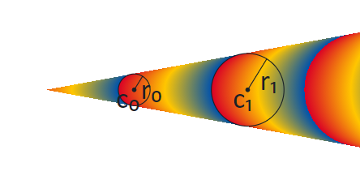

**Figure 5.16 Radial gradient using repeat extend mode.**

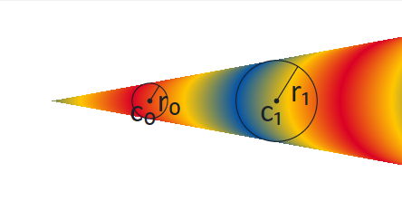

**Figure 5.17 Radial gradient using reflect extend mode.**

Figures 5.18 – 5.20 illustrate the case in which the circles have distinct centers but
the same radii, and neither circle is contained within the other, giving the
appearance of a strip. The color stops are as in the previous figures.


**Figure 5.18 Radial gradient with same-size circles appearing as a string, using pad extend mode.**


**Figure 5.19 Radial gradient with same-size circles appearing as a string, using repeat extend mode.**


**Figure 5.20 Radial gradient with same-size circles appearing as a string, using reflect extend mode.**

Because the rendering algorithm progresses ω in a particular direction, from
positive infinity to negative infinity, and because pixels are not re-painted as
ω progresses, the appearance will be affected by which circle is considered
circle 0 and which is circle 1. This is illustrated in figures 5.21 – 5.23. The
gradient in figure 5.21 is the same as that in figure 5.15, using the pad extend
mode. In this gradient, circle 0 is the small circle, on the left. In figure
5.22, the start and end circles are reversed: circle 0 is the large circle, on
the right. The color line is kept the same, and so the red end starts at circle
0, now on the right. In figure 5.23, the order of stops in the color line is
also reversed to put red on the left. The key difference to notice between the
gradients in these figures is the way that colors are painted in the interior:
when the two circles are not overlapping, the arcs of constant color bend in the
same direction as the near side of circle 1.

NOTE: This difference does not exist if one circle is entirely contained within
the other: in that case, the arcs of constant color are complete circles.

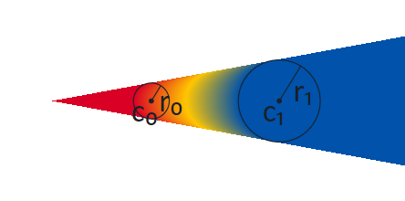

**Figure 5.21 Cone-shaped radial gradient with circle 0 on the left.**

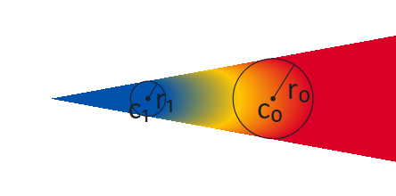

**Figure 5.22 Cone-shaped radial gradient with start and end circles swapped.**

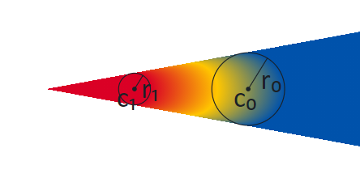

**Figure 5.23 Cone-shaped radial gradient with start and end circles swapped and color line reversed.**

When one circle is contained within the other, the extension of the gradient
beyond the larger circle will fill the entire surface. Colors in the areas
inside the inner circle and outside the outer circle are determined by the
extend mode. Figures 5.24 – 5.26 illustrate this for the different extend modes.

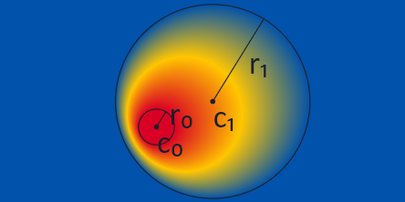

**Figure 5.24 Radial gradient with one circle contained within the other, pad extend mode.**

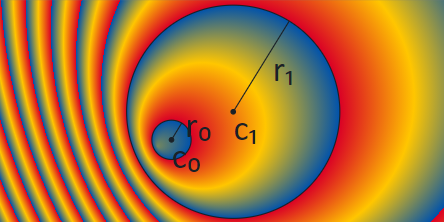

**Figure 5.25 Radial gradient with one circle contained within the other, repeat extend mode.**


**Figure 5.26 Radial gradient with one circle contained within the other, reflect extend mode.**

NOTE: When a radial gradient is combined with a transformation (see 5.7.11.1.5),
the appearance will be the same as if the geometry of the two circles were
transformed and step 3 of the algorithm were performed by interpolating the
shapes derived from the two transformed circles. For the condition r(ω) > 0, the
pre-transformation values of r(ω) can be used.

NOTE: A scale transformation can flatten shapes to resemble lines. If a radial
gradient is nested in the child sub-graph of a transformation that flattens the
circles so that they are nearly lines, the centers could still be separated by
some distance. In that case, the radial gradient would appear as a strip or a
cone filled with a linear gradient.

If a radial gradient is nested in the sub-graph of a transformation that
flattens the circles so that they form a single line (or nearly a line, for an
implementation-determined definition), with both centers on that line, then the
resulting gradient is degenerate and shall not be rendered.

NOTE: As seen in the figures above, the gradient fills the space when one circle
is contained within the other, but not when neither circle is contained within
the other. In a variable font, if the placement or radii of the circles vary,
then a sharp transition can occur if the variation results in one circle being
contained with the other for some instances but not for other instances. This
transition will occur when the inner circle just touches the outer circle (i.e.,
they have exactly one point in common). In this case, the gradient will fill
exactly one half of the space. This is illustrated in figure 5.27 using the pad
extend mode.

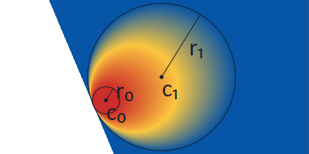

**Figure 5.27 Radial gradient with inner circle just touching the outer circle, pad extend mode.**

When the repeat or reflect extend modes are used, having the two circles in very
close proximity results in very high spatial-frequency transitions that can lead
to Moiré patterns or other display artifacts. This is illustrated in figure
5.28, which shows the display result, for one particular rendering context, of a
radial gradient defined using nearly-identical circles and the reflect extend
mode.

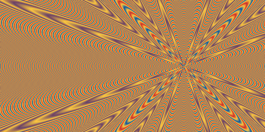

**Figure 5.28 Radial gradient defined using nearly-identical circles and reflect extend mode, displaying with interference patterns**

The artifacts seen can be affected by a combination of several factors, such as
image scaling, sub-pixel rendering, display technology, and limitations in
software implementation or display capabilities. For this reason, the appearance
can be very different in different situations. Font designers should exercise
caution if the circles are in close proximity (either in a static design or for
some variable font instances), and should not rely on these display artifacts to
obtain a particular pattern.

**5.7.11.1.2.4 Sweep gradients**

A sweep gradient provides a gradation of colors that sweep around a center
point. For a given color on a color line, that color projects as a ray from the
center point in a given direction. This is illustrated in figure 5.29.

NOTE: The following figures illustrate sweep gradients clipped to a circular
region. Sweep gradients are not bounded, however, and fill the entire space.

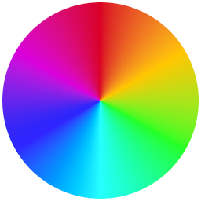

**Figure 5.29 Sweep gradient**

NOTE: In some contexts, this type of gradient is referred to as a “conic”
gradient, or as an “angular” gradient.

A sweep gradient is defined by a center point, starting and ending angles, and a
color line. The angles are expressed in counter-clockwise degrees from the
direction of the y-axis on the design grid.

The color line is aligned to a circular arc around the center point, with
arbitrary radius, with stop offset 0 aligned with the starting angle, and stop
offset 1 aligned with the ending angle. The color line progresses in the
counter-clockwise direction; for example, if the start and end angles are both
0°, then stop offset 0.1 is at 36° counter-clockwise from the direction of the
y-axis.

The color line may be defined using color stops outside the range [0, 1], and
color stops outside the range [0, 1] can be used to interpolate color values
within the range [0, 1], but only color values for the range [0, 1] are painted.
If the specified color stops cover the entire [0, 1] range (or beyond), then the
extend mode is not relevant and may be ignored. If the specified color stops do
not cover the entire [0, 1] range, the extend mode is used to determine color
values for the remainder of that range. For example, if a color line is
specified with two color stops, red at stop offset 0.3 and yellow at stop offset
0.6, and the pad extend mode is specified, then the extend mode is used to
derive color values from 0.0 to 0.3 (red), and from 0.6 to 1.0 (yellow).

Because a sweep gradient is defined using start and end angles, the gradient
does not need to cover a full 360° sweep around the center. This is illustrated
in figure 5.30:

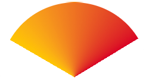

**Figure 5.30 A sweep gradient, from red to yellow, with start angle of -60° and an end angle of 60°.**

Start and end angle values can be outside the range [0, 360), but are
interpreted as values within that range by applying a modulus operation. For
example, an angle -60° is treated the same as 300°; an angle 480° is treated the
same as 120°. As a consequence, the color line covers at most one full
revolution around the center, never more.

If the starting and ending angle are the same, a sharp color transition can
occur if the colors at stop offsets 0 and 1 are different. This is illustrated
in figure 5.31, showing a gradient from red to yellow that starts and stops at
0°.


**Figure 5.31 A sweep gradient, from red to yellow, with a sharp transition at the start/end angle 0°.**

To avoid such a sharp transition, the stop offsets 0 and 1 on the color line
need to have the same color value. Figure 5.32 illustrates a sweep gradient that
transitions from red at stop offset 0, to yellow at stop offset 0.5, and back to
red at stop offset 1.0.

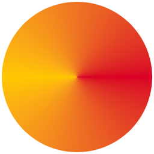

**Figure 5.32 A sweep gradient, from red to yellow to red, with a smooth transition at the start/end angle 0°.**

NOTE: When a sweep gradient is combined with a transformation (see 5.7.11.1.5),
the appearance will be the same as if a circular arc of some non-zero radius
were computed from the start and end angles; the center point and arc
transformed; the color line aligned to the transformed arc; and then a gradient
derived from the result, with rays from the transformed center point passing
through the transformed color arc. When aligning the color line to the
transformed arc, stop offset 0 would be aligned to the transformed point derived
from the start angle, with stop offset 1 aligned to the transformed point
derived from the end angle. Thus, a transform can result in the color line
progressing in a clockwise rather than counter-clockwise direction.

**5.7.11.1.3 Filling shapes**

All basic shapes used in a color glyph are obtained from glyph outlines,
referenced using a glyph ID. In a color glyph description, a PaintGlyph table is
used to represent a basic shape. 

NOTE: Shapes can also be derived using PaintGlyph tables in combination with
other tables, such as PaintTransform (see 5.7.11.1.5) or PaintComposite (see
5.7.11.1.6).

The PaintGlyph table has a field for the glyph ID, plus an offset to a child
paint table that is used as the fill for the shape. The glyph outline is not
rendered; only the fill is rendered.

Any of the basic fill formats—PaintSolid, PaintLinearGradient,
PaintRadialGradient, or PaintSweepGradient—can be used as the child paint table.
This is illustrated in figure 5.33: a PaintGlyph table has a glyph ID for an
outline in the shape of a triangle, and it links to a child PaintLinearGradient
table. The combination is used to represent a triangle filled with the linear
gradient.


**Figure 5.33 PaintGlyph and PaintLinearGradient tables used to fill a shape with a linear gradient.**

The child of a PaintGlyph table is not, however, limited to one of the basic
fill formats. Rather, the child can be the root of a sub-graph that describes
some graphic composition that is used as a fill. Another way to describe the
relationship between a PaintGlyph table and its child sub-graph is that the
glyph outline specified by the PaintGlyph table defines a bounds, or *clip
region*, that is applied to the fill composition defined by the child sub-graph.

To illustrate this, the example in figure 5.33 is extended in figure 5.34 so
that a PaintGlyph table links to a second PaintGlyph that links to a
PaintLinearGradient: the parent PaintGlyph will clip the filled shape described
by the child sub-graph.


**Figure 5.34 A PaintGlyph table defines a clip region for the composition defined by its child sub-graph.**

A PaintGlyph table on its own does not add content: if there is no child paint
table, then the graph is not well formed. See 5.7.11.1.9 for details regarding
well-formedness and validity of the graph.

**5.7.11.1.4 Layering**

Layering of visual elements was introduced above, in the introduction to
5.7.11.1. Both version 0 and version 1 support use of multiple layers, though in
different ways.

For version 0, layers are fundamental: they are the sole way in which separate
elements are composed into a color glyph. An array of LayerRecords is created,
with each LayerRecord specifying a glyph ID and a CPAL entry (a shape and solid
color fill). Each color glyph definition is a slice from that array (that is, a
contiguous sub-sequence), specified in a BaseGlyphRecord for a particular base
glyph. Within a given slice, the first record specifies the content of the
bottom layer, and each subsequent record specifies content that overlays the
preceding content(increasing z-order). A single array is used for defining all
color glyphs. The LayerRecord slices for two base glyphs may overlap, though
often will not overlap.

Figure 5.35 illustrates layers using version 0 formats.

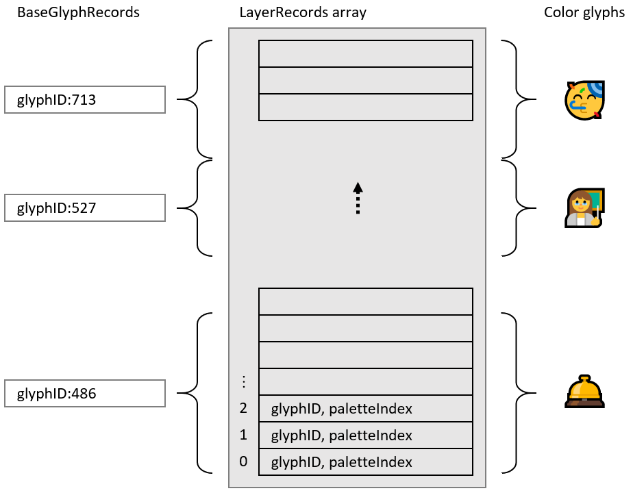

**Figure 5.35 Version 0: Color glyphs are defined by slices of a layer records array.**

When using version 1 formats, use of multiple layers is supported but is
optional. For example, a simple glyph description need not use any layering, as
illustrated in figure 5.36:


**Figure 5.36 Complete color glyph definition without use of layers.**

The version 1 formats define a color glyph as a directed, acyclic graph of paint
tables, and the concept of layering corresponds roughly to the number of
distinct leaf nodes in the graph. (See 5.7.11.1.9.) The basic fill
formats—PaintSolid, PaintLinearGradient, PaintRadialGradient, and
PaintSweepGradient—do not have child paint tables and so can only be leaf nodes
in the graph. Some paint tables, such as the PaintGlyph table, have only a
single child, so can be used within a layer but do not provide any means of
adding additional layers. Increasing the number of layers requires paint tables
that have two or more children, creating a fork in the graph.

The version 1 formats include two paint formats that have two or more children,
and so can increase the number of layers in the graph:

* The PaintComposite table allows two sub-graphs to be composed together using
different compositing or blending modes.

* The PaintColrLayers table supports defining a sequence of several layers.

NOTE: The PaintColrGlyph table provides a means of incorporating the graph of
one color glyph as a sub-graph in the definition of another color glyph. In this
way, PaintColrGlyph provides an indirect means of introducing additional layers
into a color glyph definition: forks in the resulting graph do not come from the
PaintColrGlyph table itself, but can come from PaintColrLayers or PaintComposite
tables that are nested in the incorporated sub-graph. See 5.7.11.1.7.3 for a
description of the PaintColrGlyph table.

While the PaintComposite table only combines two sub-graphs, other
PaintComposite tables can be nested to provide additional layers. The primary
purpose of PaintComposite is to support compositing or blending modes other than
simple alpha blending. The PaintComposite table is covered in more detail in
5.7.11.1.6. The remainder of this clause will focus on the PaintColrLayers
table.

The PaintColrLayers table is used to define a bottom-up z-order sequence of
layers. Similar to version 0, it defines a layer set as a slice in an array, but
in this case the array is an array of offsets to paint tables, contained in a
LayerV1List table. Each referenced paint table is the root of a sub-graph of
paint tables that specifies a graphic composition to be used as a layer. Within
a given slice, the first offset provides the content for the bottom layer, and
each subsequent offset provides content that overlays the preceding content.
Definition of a layer set—a slice within the layer list—is given in a
PaintColorLayers table.

Figure 5.37 illustrates the organizational relationship between PaintColorLayers
tables, the LayerV1List, and referenced paint tables that are roots of
sub-graphs.

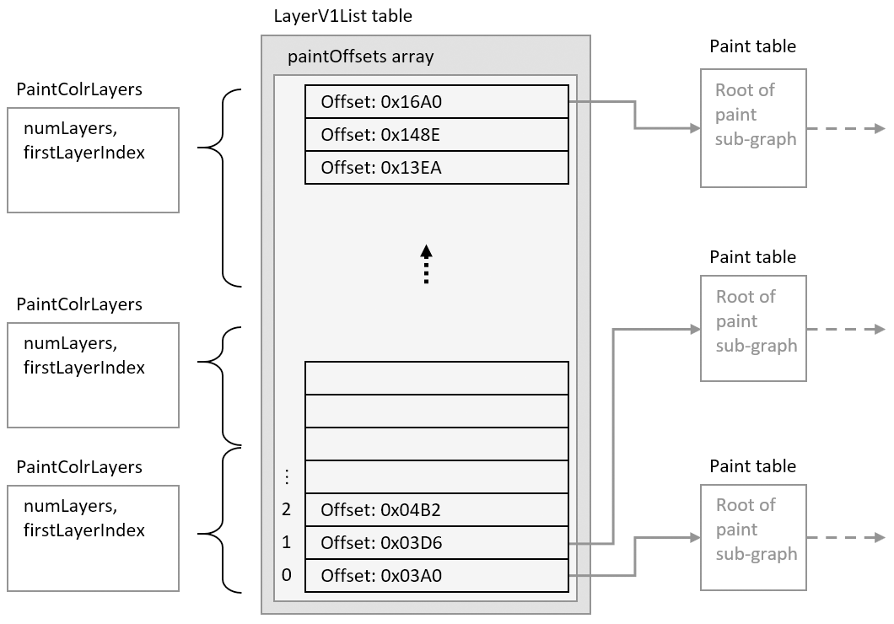

**Figure 5.37 Version 1: PaintColrLayers tables specify slices within the LayerV1List, providing a layering of content defined in sub-graphs.**

NOTE: Paint table offsets in the LayerV1List table are only used in conjunction
with PaintColrLayers tables. If a paint table does not need to be referenced via
a PaintColrLayers table, its offset does not need to be included in the
LayerV1List array.

A PaintColorLayers table can be used as the root of a color glyph definition,
providing a base layering structure for the color glyph. In this usage, the
PaintColrLayers table is referenced by a BaseGlyphV1Record, which specifies the
root of the graph of a color glyph definition for a given base glyph. This is
illustrated in figure 5.38.


**Figure 5.38 PaintColrLayers table used as the root of a color glyph definition.**

A PaintColorLayers table can also be nested more deeply within the graph,
providing a layer structure to define some component within a larger color glyph
definition. (See 5.7.11.1.7.2 for more information.) The ability to nest a
PaintColrLayers table within a graph creates the potential to introduce a cycle
within the graph, which would be invalid (see 5.7.11.1.9).

**5.7.11.1.5 Transformations**

A PaintTransform table can be used within a color glyph description to apply an
affine transformation matrix. Transformations supported by a matrix can be a
combination of scale, skew, mirror, rotate, or translate. The transformation is
applied to all nested paints in the child sub-graph.

The effect of a PaintTransform table is illustrated in figure 5.39: a
PaintTransform is used to specify a rotation, and both the glyph outline and
gradient in the sub-graph are rotated.


**Figure 5.39 A rotation transformation rotates the fill content defined by the child sub-graph.**

If another PaintTransform table occurs within the child sub-graph of the first
PaintTransform table, then the other PaintTransform also applies to its child
sub-graph. For the sub-sub-graph, the two transformations are combined. To
illustrate this, the example in figure 5.39 is extended in figure 5.40 by
inserting a mirroring transformation between the PaintGlyph and
PaintLinearGradient tables: the glyph outline is rotated as before, but the
gradient is mirrored in its (pre-rotation) y-axis as well as being rotated.
Notice that both visible elements—the shape and the gradient fill—are affected
by the rotation, but only the gradient is affected by the mirroring.


**Figure 5.40 Combined effects of a transformation nested within the child sub-graph of another transformation.**

The affine transformation is specified in a PaintTransform table as matrix
elements. See 5.7.11.2.5.8 for format details.

Whereas the PaintTransform table supports several types of transforms, the
PaintTranslate, PaintRotate and PaintSkew tables each support specific
transformations: translation, rotation and skew. The PaintTranslate table
provides a more compact representation for this common transform. The
significant difference of the PaintRotate and PaintSkew formats is that
rotations and skews are specified as angles, in counter-clockwise degrees.

NOTE: Specifying the rotation or skew as an angle can have a signficant benefit
in variable fonts if an angle of skew or rotation needs to vary, since it is
easier to implement variation of angles when specified directly rather than as
matrix elements. This is because the matrix elements for a rotation or skew are
the sine, cosine or tangent of the rotation angle, which do not change in linear
proportion to the angle. To achieve a linear variation of rotation using matrix
elements would require approximating the variation using multiple delta sets.

The rotations and skews specified using PaintRotate or PaintSkew tables can also
be representated as a matrix using a PaintTransform table. If a PaintRotate or
PaintSkew table is used in combination with a PaintTransform table, the
combined behavior shall be the same as if the rotation or skew were represented
using an equivalent matrix. See 5.7.11.2.5.10 for details regarding the matrix
equivalent for a rotation expressed as an angle; and see 5.7.11.2.5.11 for
similar details in relation to skews.

**5.7.11.1.6 Compositing and blending**

When a color glyph has overlapping content in two layers, the pixels in the two
layers must be combined in some way. If the content in the top layer has full
opacity, then normally the pixels from that layer are shown, occluding
overlapping pixels from lower layers. If the top layer has some transparency
(some portion has alpha less than 1.0), then blending of colors for overlapping
pixels occurs by default. The default interaction between layers uses simple
alpha compositing, as described in [Compositing and Blending Level 1][1].

A PaintComposite table can be used to get other compositing or blending effects.
The PaintComposite table combines content defined by two sub-graphs: a *source*
sub-graph; and a destination, or *backdrop*, sub-graph. First, the paint
operations for the backdrop sub-graph are executed, then the drawing operations
for the source sub-graph are executed and combined with backdrop using a
specified compositing or blending mode. The available modes are given in the
CompositionModes enumeration (see 5.7.11.2.5.12). The effect and processing rule
of each mode are specified in [Compositing and Blending Level 1][1].

The available modes fall into two general types: compositing modes, also
referred to as “Porter-Duff” modes; and blending modes. In rough terms, the
Porter-Duff modes determine how much effect pixels from the source and the
backdrop each contribute in the result, while blending modes determine how color
values for pixels from the source and backdrop are combined. These are
illustrated with examples in figures 5.41 and 5.42: in each case, red and blue
rectangles are the source and backdrop content.

Figure 5.41 shows the effect of a Porter-Duff mode, *XOR*, which has the effect
that only non-overlapping pixels contribute to the result.

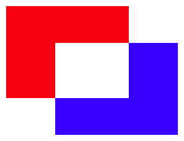

**Figure 5.41 Two content elements combined using the Porter-Duff *XOR* mode.**

Figure 5.42 shows the effect of a *lighten* blending mode, which has the effect
that the R, G, and B color components for each pixel in the result is the
greater of the R, G, and B values from corresponding pixels in the source and
backdrop.


**Figure 5.42 Two content elements combined using the *lighten* blending mode.**

For complete details on each of the Porter-Duff and blending modes, see the
[Compositing and Blending Level 1][1] specification.

Figure 5.43 illustrates how the PaintComposite table is used in combination with
content sub-graphs to implement an alternate compositing effect. The source
sub-graph defines a green capital A; the backdrop sub-graph defines a black
circle. The compositing mode used is *Source Out*, which has the effect that the
source content punches out a hole in the backdrop. (For this mode, the fill
color of the source is irrelevant; a black or yellow “A” would have the same
effect.) A red rectangle is included as a lower layer to show that the backdrop
has been punched out by the source, making that portion of the lower layer
visible.


**Figure 5.43 A color glyph using a PaintComposite table to punch out a shape from the fill of a circle.**

NOTE: In figure 5.43, the “A” is filled with green to illustrate that the color
of the fill has no affect for the *Source Out* composite mode. Because that is the
case, the black or red PaintSolid could have been re-used instead of adding a
separate PaintSolid table. See 5.7.11.1.7.1 for more information on re-use of
paint tables for such situations.

[Scalable Vector Graphics (SVG)][32] supports alpha channel masking using the
&lt;mask&gt; element. The same effects can be implemented in COLR version 1
using a PaintComposite table by setting a pattern of alpha values in the source
sub-graph and selecting the *Source In* composite mode. This is illustrated in
figure 5.44.


**Figure 5.44 An alpha mask implemented using a PaintComposite table and the *Source In* mode.**

**5.7.11.1.7 Re-usable components**

Within a color font, many color glyphs might share components in common. For example, in emoji fonts, many different “smilies” or clock faces share a common background. This can be seen in figure 5.45, which shows color glyphs for three emoji clock faces.


**Figure 5.45 Emoji clock faces for 12 o’clock, 1 o’clock and 2 o’clock.**

Several components are shared between these color glyphs: the entire face, with
a gradient background and dots at the 3, 6, 9 and 12 positions; the minute hand
pointing to the 12 position; and the circles in the center. Also, note that the
four dots have the same shape and fill, and differ only in their position. In
addition, the hour hands have the same shape and fill, and differ only in their
orientation.

There are several ways in which elements of a color glyph description can be
re-used:

* Reference to shared subtables
* Use of a PaintColrLayers table
* Use of a PaintColrGlyph table

The PaintColrLayers and PaintColrGlyph table formats create a potential for
introducing cycles within the graph of a color glyph, which would be invalid
(see 5.7.11.1.9).

**5.7.11.1.7.1 Re-use by referencing shared subtables**

Several of the paint table formats link to a child paint table using a forward
offset within the file: PaintGlyph, PaintComposite, PaintTransform,
PaintRotate, and PaintSkew. A child subtable can be shared by several tables of
these formats. For example, several PaintGlyph tables might link to the same
PaintSolid table, or to the same node for a sub-graph describing a more complex
fill. The only limitation is that child paint tables are referenced using a
forward offset from the start of the referencing table, so a re-used paint table
can only occur later in the file than any of the paint tables that use it.

The clock faces shown in figure 5.45 provide an example of how PaintRotate
tables can be combined with re-use of a sub-graph. As noted above, the hour
hands have the same shape and fill, but have a different orientation. The glyph
outline could point to the 12 position, then in color glyph descriptions for
other times, PaintRotate tables could link to the same glyph/fill sub-graph,
re-using that component but rotated as needed.

This is illustrated in the figures 5.46 and 5.47. Figure 5.46 shows a sub-graph
defining the hour hand, with upright orientation, using a PaintGlyph and a
PaintSolid table. Example file offsets for the tables are indicated.

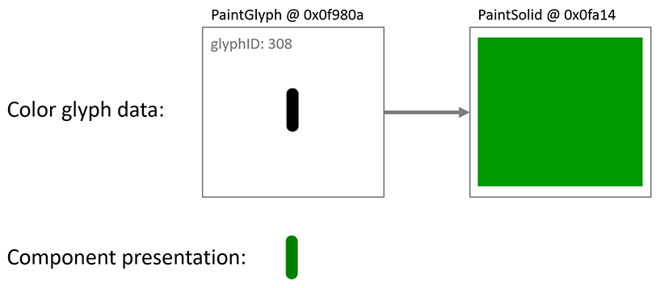

**Figure 5.46 A PaintGlyph and PaintSolid table are used to define the clock hour hand pointing to 12.**

Figure 5.47 shows this sub-graph of paint tables being re-used, in some cases
linked from PaintRotate tables that rotate the hour hand to point to different
clock positions as needed. All of the paint tables that reference this sub-graph
occur earlier in the file.

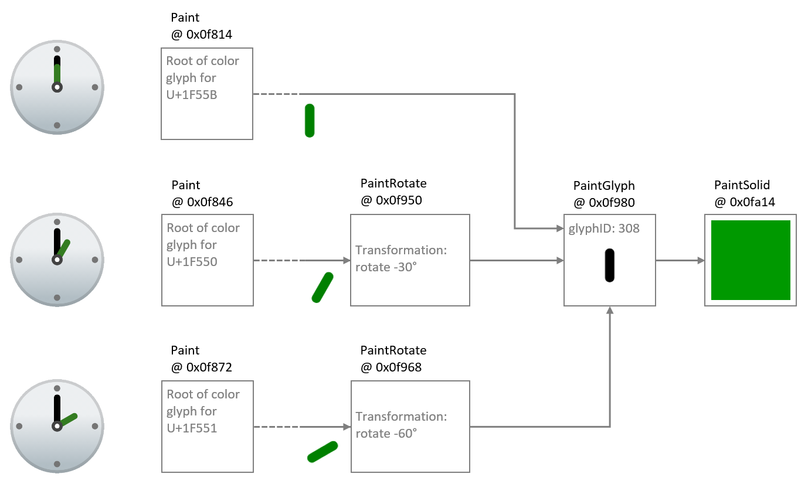

**Figure 5.47 The sub-graphs for the hour hand are re-used with PaintRotate tables to point to different hours.**

**5.7.11.1.7.2 Re-use using PaintColrLayers**

As described above (see 5.7.11.1.4), a PaintColrLayers table defines a set of
paint sub-graphs arranged in bottom-up z-order layers, and an example was given
of a PaintColrLayers table used as the root of a color glyph definition. A
PaintColrLayers table can also be nested more deeply within the graph of a color
glyph. One purpose for doing this is to reference a re-usable component defined
as a contiguous set of layers in the LayersV1List table.

This is readily explained using the clock faces as an example. As described
above, each clock face shares several elements in common. Some of these form a
contiguous set of layers. Suppose four sub-graphs for shared clock face elements
are given in the LayerV1List as contiguous layers, as shown in figure 5.48. (For
brevity, the visual result for each sub-graph is shown, but not the paint
details.)

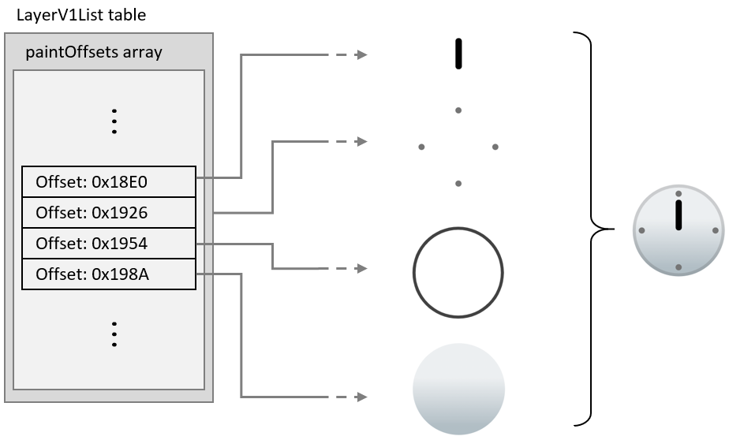

**Figure 5.48 Common clock face elements given as a slice within the LayerV1List table.**

A PaintColrLayers table can reference any contiguous slice of layers in the
LayerV1List table. Thus, the set of layers shown in figure 5.48 can be
referenced by PaintColrLayers tables anywhere in the graph of any color glyph.
In this way, this set of layers can be re-used in multiple clock face color
glyph definitions.

This is illustrated in figure 5.49: The color glyph definition for the one
o’clock emoji has a PaintColrLayers table as its root, referencing a slice of
three layers in the LayerV1List table. The upper two layers are the hour hand,
which is specific to this color glyph; and the cap over the pivot for the minute
and hour hands, which is common to other clock emoji but in a layer that is not
contiguous with other common layers. The bottom layer of these three layers is
the composition for all the remaining common layers. It is represented using a
nested PaintColrLayers table that references the slice within the LayerV1List
for the common clock face elements shown in figure 5.48.

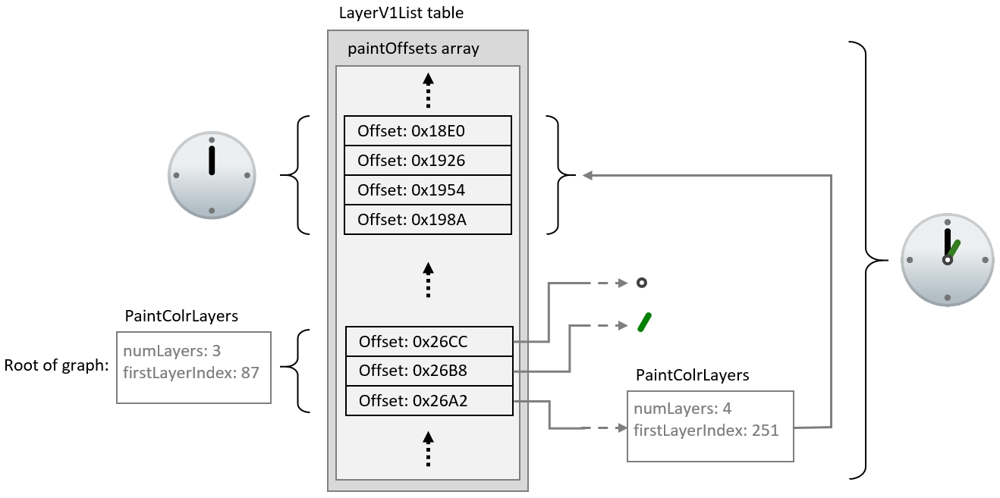

**Figure 5.49 A PaintColrLayers table is used to reference a set of layers that define a shared clock face composition.**

The color glyphs for other clock face emoji could be structured in exactly the
same way, using a nested PaintColrLayers table to re-use the layer composition
of the common clock face elements.

**5.7.11.1.7.3 Re-use using PaintColrGlyph**

A third way to re-use components in color glyph definitions is to use a nested
PaintColrGlyph table. This format references a base glyph ID, which is used to
access a corresponding BaseGlyphV1Record. That record will provide the offset of
a paint table that is the root of a graph for a color glyph definition. That
graph can potentially be used as an independent color glyph, but it can also
define a shared composition that gets re-used in multiple color glyphs. Each
time the shared composition is to be re-used, it is referenced by its base glyph
ID using a PaintColrGlyph table. The graph of the referenced color glyph is
thereby incorporated into the graph of the PaintColrGlyph table as its child
sub-graph.

The glyph ID used may be that for a glyph outline, if there is an appropriate
glyph outline that corresponds to this composition. But the glyph ID may also be
greater than the last glyph ID used for outlines—that is, greater than or equal
to the numGlyphs value in the &#39;maxp&#39; table (5.2.6). Such virtual base
glyph IDs in the COLR table are only used within a PaintColrGlyph table, and are
not related to glyph IDs used in any other tables.

When a PaintColrGlyph table is used, a BaseGlyphV1Record with the specified
glyph ID is expected. If no BaseGlyphV1Record with that glyph ID is found, the
color glyph is not well formed. See 5.7.11.1.9 for details regarding
well-formedness and validity of the graph.

The example from 5.7.11.1.7.2 is modified to illustrate use of a PaintColrGlyph
table. In figure 5.50, a PaintColrLayers table references a slice within the
LayerV1List that defines the shared component. Now, however, this
PaintColrLayers table is treated as the root of a color glyph definition for
base glyph ID 63163. The color glyph for the one o’clock emoji is defined with
three layers, as before, but now the bottom layer uses a PaintColrGlyph table
that references the color glyph definition for glyph ID 63163.

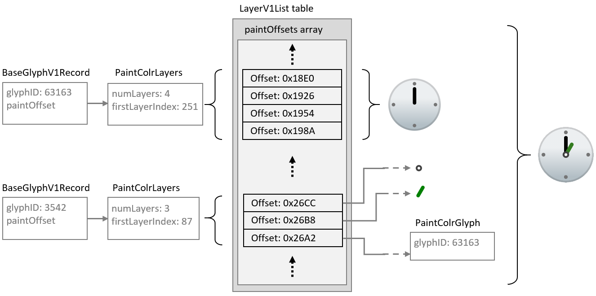

**Figure 5.50 A PaintColrGlyph table is used to reference the shared clock face composition via a glyph ID.**

While the PaintColrGlyph and PaintColrLayers tables are similar in being able to
reference a layer set as a re-usable component, they could be handled
differently in implementations. In particular, an implementation could process
and cache the result of the color glyph description for a given base glyph ID.
In that case, subsequent references to that base glyph ID using a PaintColrGlyph
table would not require the corresponding graph of paint tables to be
re-processed. As a result, using a PaintColrGlyph for re-used graphic components
could provide performance benefits.

**5.7.11.1.8 Glyph metrics and boundedness**

**5.7.11.1.8.1 Metrics for color glyphs using version 0 formats**

For color glyphs using version 0 formats, the advance width of glyphs used for
each layer shall be the same as the advance width of the base glyph. If the font
has vertical metrics,  the glyphs used for each layer shall also have the same
advance height and vertical Y origin as the base glyph.

**5.7.11.1.8.2 Metrics and boundedness of color glyphs using version 1 formats**

For color glyphs using version 1 formats, the advance width of the base glyph
shall be used as the advance width for the color glyph. If the font has vertical
metrics, the advance height and vertical Y origin of the base glyph shall be
used for the color glyph. The advance width and height of glyphs referenced by
PaintGlyph tables are not required to be the same as that of the base glyph and
are ignored.

The bounding box of the base-glyph contours is used as the bounding box of the
color glyph. A &#39;glyf&#39; entry with two points at diagonal extrema is
sufficient to define the bounding box.

NOTE: The bounding box of the base glyph can be used to allocate a drawing
surface without needing to traverse the graph of the color glyph definition.

A valid color glyph definition shall define a bounded region—that is, it shall
paint within a region for which a finite bounding box could be defined. The
different paint formats have different boundedness characteristics:

* PaintGlyph is inherently bounded.
* PaintSolid, PaintLinearGradient, PaintRadialGradient, and PaintSweepGradient
are inherently unbounded.
* PaintColrLayers is bounded *if and only if* all referenced sub-graphs are
bounded.
* PaintColrGlyph is bounded *if and only if* the color glyph definition for the
referenced base glyph ID is bounded.
* PaintTransform, PaintTranslate, PaintRotate and PaintSkew are bounded *if
and only if* the referenced sub-graph is bounded.
* PaintComposite is either bounded or unbounded, according to the composite mode
used and the boundedness of the referenced sub-graphs. See 5.7.11.2.5.12 for
details.

Applications shall confirm that a color glyph definition is bounded, and shall
not render a color glyph if the defining graph is not bounded.

**5.7.11.1.9 Color glyphs as a directed acyclic graph**

When using version 1 formats, a color glyph is defined by a directed, acyclic
graph of linked paint tables. For each BaseGlyphV1Record, the paint table
referenced by that record is the root of a graph defining a color glyph
composition.

The graph for a given color glyph is made up of all paint tables reachable from
the BaseGlyphV1Record. The BaseGlyphV1Record and several paint table formats use
direct links; that is, they include a forward offset to a paint subtable. Two
paint formats make indirect links:

* A PaintColrLayers table references a slice of offsets within the LayerV1List.
The paint tables referenced by those offsets are considered to be linked within
the graph as children of the PaintColrLayers table.

* A PaintColrGlyph table references a base glyph ID, for which a corresponding
BaseGlyphV1Record is expected. That record points to the root of a graph that is
a complete color glyph definition on its own. But when referenced in this way by
a PaintColrGlyph table, that entire graph is considered to be a child sub-graph
of the PaintColrGlyph table, and a continuation of the graph of which the
PaintColrGlyph table is a part.

The graph for a color glyph is a combination of paint tables using any of the
paint table formats. The simplest color glyph definition would consist of a
PaintGlyph table linked to a basic fill table (PaintSolid, PaintLinearGradient,
PaintRadialGradient, or PaintSweepGradient). But the graph can be arbitrarily
complex, with an arbitrary depth of paint nodes (to the limits inherent in the
formats).

The graph can define a visual element in a single layer, or many elements in
many layers. The concept of layers, as distinct visual elements stacked in a
z-order, is not precisely defined in relation to the complexity of the graph.
Each separate visual element requires a leaf node, but nodes in the graph,
including leaf nodes, can be re-used (see 5.7.11.1.7). Also, each separate
visual element requires a fork in the graph, and a separate root-to-leaf path,
but not all paths necessarily result in a distinct visual element. For example,
a gradient mask effect can be created with a gradient with gradation of alpha
values, and then using that as the source of a PaintComposite table with the
*Source In* compositing mode. In that case, the leaf has a visual affect but
does not result in a distinct visual element. This was illustrated in figure
5.44, repeated here as figure 5.51: the PaintLinearGradient is a leaf node in
the graph and creates a masking effect but does not add a distinct visual
element.


**Figure 5.51 Graph with a leaf node that isn’t a distinct visual element.**

Thus, the generalization that can be made regarding the relationship between the
number of layers and the nature of the graph is that the number of distinct
root-to-leaf paths will be greater than or equal to the number of layers.

The following are necessary for the graph to be well-formed and valid:

* All subtable links shall satisfy the following criteria:
  * Forward offsets are within the COLR table bounds.
  * If a PaintColrLayers table is present, then a LayersV1List is also present,
and the referenced slice is within the length of the LayersV1List.
  * If a PaintColrGlyph table is present, there is a BaseGlyphV1Record for the
referenced base glyph ID.
* The graph shall be acyclic.

NOTE: These constraints imply that all leaf nodes will be one of PaintSolid,
PaintLinearGradient, PaintRadialGradient, or PaintSweepGradient.

For the graph to be acyclic, no paint table shall have any child or descendent
paint table that is also its parent or ancestor within the graph. In particular,
because the PaintColrLayers and PaintColrGlyph tables use indirect child
references rather than forward offsets, they provide a possibility for
introducing cycles. Applications should track paint tables within a path in the
graph, checking whether any paint table was already encountered within that
path. The following pseudo-code algorithm can be used:

```
    // called initially with the root paint and an empty set pathPaints
    function paintIsAcyclic(paint, pathPaints)
        if paint is in pathPaints
          return false // cycle detected
        add paint to pathPaints
        for each childPaint referenced by paint as a child subtable
          call paintIsAcyclic(childPaint, pathPaints)
        remove paint from pathPaints
```

For the graph to be valid, it shall also be visually bounded, as described in
5.7.11.1.8.2.

NOTE: Implementations can combine testing for cycles and other well-formedness
or validity requirements together with other processing for rendering the color
glyph.

If the graph contains a cycle or is otherwise not well formed or valid, the
paint table at which the error occurs should be ignored, that sub-graph should
not be rendered, and that node in the graph should be considered to be visually
bounded. The application should attempt to render the remainder of the graph, if
well formed and valid.

Future minor version updates of the COLR table could introduce new paint
formats. If a paint table with an unrecognized format is encountered, it and its
sub-graph should similarly be ignored, the node should be considered to be
visually bounded, and the application should attempt to render the remainder of
the graph.

If an application is not able to recover from errors while traversing the graph,
it may ignore the color glyph entirely. If the base glyph ID has an outline,
that may be rendered as a non-color glyph instead.

**5.7.11.2 COLR table formats**

Various table and record formats are defined for COLR version 0 and version 1.
Several values contained within the version 1 formats are variable. These use
various record formats that combine a basic data type with a variation delta-set
index: VarFWord, VarUFWord, VarF2Dot14, and VarFixed. These are described in
7.2.3.1.

All table offsets are from the start of the parent table in which the offset is
given, unless otherwise indicated.

**5.7.11.2.1 COLR header**

The COLR table begins with a header. Two versions have been defined. Offsets in
the header are from the start of the table.

**5.7.11.2.1.1 COLR version 0**

*COLR version 0:*

| Type | Field name | Description |
|-|-|-|
| uint16 | version | Table version number—set to 0. |
| uint16 | numBaseGlyphRecords | Number of BaseGlyph records. |
| Offset32 | baseGlyphRecordsOffset | Offset to baseGlyphRecords array. |
| Offset32 | layerRecordsOffset | Offset to layerRecords array. |
| uint16 | numLayerRecords | Number of Layer records. |

NOTE: For fonts that use COLR version 0, some early Windows implementations of
the COLR table require glyph ID 1 to be the .null glyph.

**5.7.11.2.1.2 COLR version 1**

*COLR version 1:*

| Type | Field name | Description |
|-|-|-|
| uint16 | version | Table version number—set to 1. |
| uint16 | numBaseGlyphRecords | Number of BaseGlyph records; may be 0 in a version 1 table. |
| Offset32 | baseGlyphRecordsOffset | Offset to baseGlyphRecords array (may be NULL). |
| Offset32 | layerRecordsOffset | Offset to layerRecords array (may be NULL). |
| uint16 | numLayerRecords | Number of Layer records; may be 0 in a version 1 table. |
| Offset32 | baseGlyphV1ListOffset | Offset to BaseGlyphV1List table. |
| Offset32 | layersV1Offset | Offset to LayerV1List table (may be NULL). |
| Offset32 | itemVariationStoreOffset | Offset to ItemVariationStore (may be NULL). |

The BaseGlyphV1List and its subtables are only used in COLR version 1.

The LayersV1List is only used in conjunction with the BaseGlyphV1List and,
specifically, with PaintColrLayers tables (5.7.11.2.5.1); it is not required if
no color glyphs use a PaintColrLayers table. If not used, set layersV1Offset to
NULL.

The ItemVariationStore is used in conjunction with a BaseGlyphV1List and its
subtables, but only in variable fonts. If it is not used, set
itemVariationStoreOffset to NULL.

**5.7.11.2.1.3 Mixing version 0 and version 1 formats**

A font that uses COLR version 1 and that includes a BaseGlyphV1List can also
include BaseGlyph and Layer records for compatibility with applications that
only support COLR version 0.

Color glyphs that can be implemented in COLR version 0 using BaseGlyph and Layer
records can also be implemented using the version 1 BaseGlyphV1List and
subtables. Thus, a font that uses the version 1 formats does not need to use the
version 0 BaseGlyph and Layer records. However, a font may use the version 1
structures for some base glyphs and the version 0 structures for other base
glyphs. A font may also include a version 1 color glyph definition for a given
base glyph ID that is equivalent to a version 0 definition, though this should
never be needed. 

A font may define a color glyph for a given base glyph ID using version 0
formats, and also define a different color glyph for the same base glyph ID
using version 1 formats. Applications that support COLR version 1 should give
preference to the version 1 color glyph.

For applications that support COLR version 1, the application should search for
a base glyph ID first in the BaseGlyphV1List. Then, if not found, search in the
baseGlyphRecords array, if present.

**5.7.11.2.2 BaseGlyph and Layer records**

BaseGlyph and Layer records are required for COLR version 0, but optional for
version 1. (See 5.7.11.2.1.3.)

A BaseGlyph record is used to map a base glyph to a sequence of layer records
that define the corresponding color glyph. The BaseGlyph record includes a base
glyph index, an index into the layerRecords array, and the number of layers.

*BaseGlyph record:*

| Type | Field name | Description |
|-|-|-|
| uint16 | glyphID | Glyph ID of the base glyph. |
| uint16 | firstLayerIndex | Index (base 0) into the layerRecords array. |
| uint16 | numLayers | Number of color layers associated with this glyph. |

The glyph ID shall be less than the numGlyphs value in the &#39;maxp&#39; table
(5.2.6).

The BaseGlyph records shall be sorted in increasing glyphID order. It is assumed
that a binary search can be used to find a matching BaseGlyph record for a
specific glyphID.

The color glyph for a given base glyph is defined by the consecutive records in
the layerRecords array for the specified number of layers, starting with the
record indicated by firstLayerIndex. The first record in this sequence is the
bottom layer in the z-order, and each subsequent layer is stacked on top of the
previous layer.

The layer record sequences for two different base glyphs may overlap, with some
layer records used in multiple color glyph definitions.

The Layer record specifies the glyph used as the graphic element for a layer and
the solid color fill.

*Layer record:*

| Type | Field name | Description |
|-|-|-|
| uint16 | glyphID | Glyph ID of the glyph used for a given layer. |
| uint16 | paletteIndex | Index (base 0) for a palette entry in the CPAL table. |

The glyphID in a Layer record shall be less than the numGlyphs value in the
&#39;maxp&#39; table. That is, it shall be a valid glyph with outline data in
the &#39;glyf&#39; (5.3.4), &#39;CFF &#39; (5.4.2) or CFF2 (5.4.3) table. See
5.7.11.1.8.2 for requirements regarding glyph metrics of referenced glyphs.

The paletteIndex value shall be less than the numPaletteEntries value in the
CPAL table (5.7.12). A paletteIndex value of 0xFFFF is a special case,
indicating that the text foreground color (as determined by the application) is
to be used.

**5.7.11.2.3 BaseGlyphV1List and LayerV1List**

The BaseGlyphV1List table is, conceptually, similar to the baseGlyphRecords
array in COLR version 0, providing records that map a base glyph to a color
glyph definition. The color glyph definition is significantly different,
however—see 5.7.11.1.

*BaseGlyphV1List table:*

| Type | Name | Description |
|-|-|-|
| uint32 | numBaseGlyphV1Records |  |
| BaseGlyphV1Record | baseGlyphV1Records[numBaseGlyphV1Records] | |

*BaseGlyphV1Record:*

| Type | Name | Description |
|-|-|-|
| uint16 | glyphID | Glyph ID of the base glyph. |
| Offset32 | paintOffset | Offset to a Paint table. |

The glyph ID is not limited to the numGlyphs value in the &#39;maxp&#39; table
(5.2.6). See 5.7.11.1.7.3 for more information.

The records in the baseGlyphV1Records array shall be sorted in increasing
glyphID order. It is intended that a binary search can be used to find a
matching BaseGlyphV1Record for a specific glyphID.

The paint table referenced by the BaseGlyphV1Record is the root of the graph for
a color glyph definition.

NOTE: Often the paint table that is the root of the graph for the color glyph
definition will be a PaintColrLayers table, though this is not required. See
5.7.11.1.9 more information regarding the graph of a color glyph, and 5.7.11.1.4
for background information regarding the PaintColrLayers table.

A LayerV1List table is used in conjunction with PaintColrLayers tables to
represent layer structures. A single LayerV1List is defined and can be used by
multiple PaintColrLayer tables, each of which references a slice of the layer
list.

*LayerV1List table:*

| Type | Field name | Description |
|-|-|-|
| uint32 | numLayers |  |
| Offset32 | paintOffsets[numLayers] | Offsets to Paint tables. |

The sequence of offsets to paint tables corresponds to a bottom-up z-order
layering of the graphic compositions defined by the sub-graph of each referenced
paint table graph. For a given slice of the list, the sub-graph of the first
paint table defines the element at the bottom of the z-order, and the sub-graph
of each subsequent paint table defines an element that is layered on top of the
previous element. As each element is a composition defined in a sub-graph, one
of these elements may itself be multi-layered. In that case, the layers of this
element are stack above all previous layers, and layers of following elements
are stacked above the top layer of this element.

Offsets for paint tables not referenced by any PaintColrLayers table should not
be included in the paintOffsets array.

**5.7.11.2.4 ColorIndex, ColorStop and ColorLine**

Colors are used in solid color fills for graphic elements, or as *stops* in a
color line used to define a gradient. Colors are defined by reference to palette
entries in the CPAL table (5.7.12). While CPAL entries include an alpha
component, a ColorIndex record is defined here that includes a separate alpha
specification that supports variation in a variable font.

*ColorIndex record:*

| Type | Name | Description |
|-|-|-|
| uint16 | paletteIndex | Index for a CPAL palette entry. |
| VarF2Dot14 | alpha | Variable alpha value. |

A paletteIndex value of 0xFFFF is a special case, indicating that the text
foreground color (as determined by the application) is to be used.

The alpha.value is always set explicitly. Values for alpha outside the range
[0., 1.] (inclusive) are reserved; values outside this range shall be clipped. A
value of zero means no opacity (fully transparent); 1.0 means fully opaque (no
transparency). The alpha indicated in this record is multiplied with the alpha
component of the CPAL entry (converted to float—divide by 255). Note that the
resulting alpha value can be combined with and does not supersede alpha or
opacity attributes set in higher-level, application-defined contexts.

See 5.7.11.1.1 for more information regarding color references and solid color
fills.

Gradients are defined using a color line. A color line is a mapping of real
numbers to color values, defined using color stops. See 5.7.11.1.2.1 for an
overview and additional details.

*ColorStop record:*

| Type | Name | Description |
|-|-|-|
| VarF2Dot14 | stopOffset | Position on a color line; variable. |
| ColorIndex | color | |

A color line is defined by an array of ColorStop records plus an extend mode.

*ColorLine table:*

| Type | Name | Description |
|-|-|-|
| uint8 | extend | An Extend enum value. |
| uint16 | numStops | Number of ColorStop records. |
| ColorStop | colorStops[numStops] | |

Applications shall apply the colorStops in increasing stopOffset order. The
stopOffset value uses a variable structure and, with a variable font, the
relative orderings of ColorStop records along the color line can change as a
result of variation. With a variable font, the colorStops shall be ordered after
the instance values for the stop offsets have been derived.

A color line defines stops for only certain positions along the line, but the
color line extends infinitely in either direction. The extend field is used to
indicate how the color line is extended. The same behavior is used for extension
in both directions. The extend field uses the following enumeration:

*Extend enumeration:*

| Value | Name | Description |
|-|-|-|
| 0 | EXTEND_PAD     | Use nearest color stop. |
| 1 | EXTEND_REPEAT  | Repeat from farthest color stop. |
| 2 | EXTEND_REFLECT | Mirror color line from nearest end. |

The extend mode behaviors are described in detail in 5.7.11.1.2.1. If a
ColorLine in a font has an unrecognized extend value, applications should use
EXTEND_PAD by default.

**5.7.11.2.5 Paint tables**

Paint tables are used for COLR version 1 color glyph definitions. Eleven Paint
table formats are defined (formats 1 to 11), each providing a different graphic
capability for defining the composition for a color glyph. The graphic
capability of each format and the manner in which they are combined to represent
a color glyph has been described above—see 5.7.11.1.

Each paint table format has a format field as the first field. When parsing font
data, the format field can be read first to determine the format of the table.

**5.7.11.2.5.1 Format 1: PaintColrLayers**

Format 1 is used to define a vector of layers. The layers are a slice of layers
from the LayerV1List table. The first layer is the bottom of the z-order, and
subsequent layers are composited on top using the COMPOSITE_SRC_OVER composition
mode (see 5.7.11.2.5.12).

For general information on the PaintColrLayers table, see 5.7.11.1.4. For
information about its use for shared, re-usable components, see 5.7.11.1.7.2.

*PaintColrLayers table (format 1):*

| Type | Field name | Description |
|-|-|-|
| uint8 | format | Set to 1. |
| uint8 | numLayers | Number of offsets to paint tables to read from LayerV1List. |
| uint32 | firstLayerIndex | Index (base 0) into the LayerV1List. |

NOTE: An 8-bit value is used for numLayers to minimize size for common
scenarios. If more than 256 layers are needed, then two or more PaintColrLayers
tables can be combined in a tree using a PaintComposite table or another
PaintColrLayers table to combine them.

**5.7.11.2.5.2 Format 2: PaintSolid**

Format 2 is used to specify a solid color fill. For general information about
specifying color values, see 5.7.11.1.1. For information about applying a fill
to a shape, see 5.7.11.1.3.

*PaintSolid table (format 2):*

| Type | Field name | Description |
|-|-|-|
| uint8 | format | Set to 2. |
| ColorIndex | color | ColorIndex record for the solid color fill. |

The ColorIndex record format is specified in 5.7.11.2.4.

**5.7.11.2.5.3 Format 3: PaintLinearGradient**

Format 3 is used to specify a linear gradient fill. For general information
about linear gradients, see 5.7.11.1.2.2. 

The PaintLinearGradient table has a ColorLine subtable. The ColorLine table
format is specified in 5.7.11.2.4. For background information on the color line,
see 5.7.11.1.2.1.

For information about applying a fill to a shape, see 5.7.11.1.3.

*PaintLinearGradient table (format 3):*

| Type | Field name | Description |
|-|-|-|
| uint8 | format | Set to 3. |
| Offset24 | colorLineOffset | Offset to ColorLine table. |
| VarFWord | x0 | Start point (p₀) x coordinate. |
| VarFWord | y0 | Start point (p₀) y coordinate. |
| VarFWord | x1 | End point (p₁) x coordinate. |
| VarFWord | y1 | End point (p₁) y coordinate. |
| VarFWord | x2 | Rotation point (p₂) x coordinate. |
| VarFWord | y2 | Rotation point (p₂) y coordinate. |

**5.7.11.2.5.4 Format 4: PaintRadialGradient**

Format 4 is used to specify a radial gradient fill. For general information
about radial gradients supported in COLR version 1, see 5.7.11.1.2.3. 

The PaintRadialGradient table has a ColorLine subtable. The ColorLine table
format is specified in 5.7.11.2.4. For background information on the color line,
see 5.7.11.1.2.1.

For information about applying a fill to a shape, see 5.7.11.1.3.

*PaintRadialGradient table (format 4):*

| Type | Field name | Description |
|-|-|-|
| uint8 | format | Set to 4. |
| Offset24 | colorLineOffset | Offset to ColorLine table. |
| VarFWord | x0 | Start circle center x coordinate. |
| VarFWord | y0 | Start circle center y coordinate. |
| VarUFWord | radius0 | Start circle radius. |
| VarFWord | x1 | End circle center x coordinate. |
| VarFWord | y1 | End circle center y coordinate. |
| VarUFWord | radius1 | End circle radius. |

**5.7.11.2.5.5 Format 5: PaintSweepGradient**

Format 5 is used to specify a sweep gradient fill. For general information
about sweep gradients, see 5.7.11.1.2.4.

The PaintSweepGradient table has a ColorLine subtable. The ColorLine table
format is specified in 5.7.11.2.4. For background information on the color line,
see 5.7.11.1.2.1.

For information about applying a fill to a shape, see 5.7.11.1.3.

*PaintSweepGradient table (format 5):*

| Type | Field name | Description |
|-|-|-|
| uint8 | format | Set to 5. |
| Offset24 | colorLineOffset | Offset to ColorLine table. |
| VarFWord | centerX | Center x coordinate. |
| VarFWord | centerY | Center y coordinate. |
| VarFixed | startAngle | Start of the angular range of the gradient. |
| VarFixed | endAngle | End of the angular range of the gradient. |

Angles are expressed in counter-clockwise degrees from the direction of the
y-axis in the design grid.


**5.7.11.2.5.5 Format 6: PaintGlyph**

Format 6 is used to specify a glyph outline to use as a shape to be filled or,
equivalently, a clip region. The outline sets a clip region that constrains the
content of a separate paint subtable and the sub-graph linked from that
subtable.

For information about applying a fill to a shape, see 5.7.11.1.3.

*PaintGlyph table (format 6):*

| Type | Field name | Description |
|-|-|-|
| uint8 | format | Set to 6. |
| Offset24 | paintOffset | Offset to a Paint table. |
| uint16 | glyphID | Glyph ID for the source outline. |

The glyphID value shall be less than the numGlyphs value in the &#39;maxp&#39;
table (5.2.6). That is, it shall be a valid glyph with outline data in the
&#39;glyf&#39; (5.3.4), &#39;CFF &#39; (5.4.2) or CFF2 (5.4.3) table. Only that
outline data is used. In particular, if this glyph ID has a description in the
COLR table (glyphID appears in a COLR BaseGlyph record or the BaseGlyphV1List),
that COLR data is not relevant for purposes of the PaintGlyph table.

**5.7.11.2.5.7 Format 7: PaintColrGlyph**

Format 7 is used to allow a color glyph definition from the BaseGlyphV1List to
be a re-usable component that can be incorporated into multiple color glyph
definitions. See 5.7.11.1.7.3 for more information.

*PaintColrGlyph table (format 7):*

| Type | Field name | Description |
|-|-|-|
| uint8 | format | Set to 7. |
| uint16 | glyphID | Virtual glyph ID for a BaseGlyphV1List base glyph. |

The glyphID value shall be a glyphID found in a BaseGlyphV1Record within the
BaseGlyphV1List. It may be a *virtual* glyph ID, greater than or equal to the
numGlyph value in the &#39;maxp&#39; table (5.2.6). The BaseGlyphV1Record
provides an offset to a paint table; that paint table and the graph linked from
it are incorporated as a child sub-graph of the PaintColrGlyph table within the
current color glyph definition.

**5.7.11.2.5.8 Format 8: PaintTransform**

Format 8 is used to apply an affine transformation to a sub-graph. The paint
table that is the root of the sub-graph is linked as a child. See 5.7.11.1.5 for
general information regarding transformations in a color glyph definition.

*PaintTransform table (format 8):*

| Type | Field name | Description |
|-|-|-|
| uint8 | format | Set to 8. |
| Offset24 | paintOffset | Offset to a Paint subtable. |
| Affine2x3 | transform | An Affine2x3 record (inline). |

The affine transformation is defined by a 2×3 matrix, specified in an Affine2x3
record. The 2×3 matrix supports scale, skew, reflection, rotation, and
translation transformations. The matrix elements use VarFixed records, allowing
the transform definition to be variable in a variable font.

*Affine2x3 record:*

| Type | Name | Description |
|-|-|-|
| VarFixed | xx | x-component of transformed x-basis vector |
| VarFixed | yx | y-component of transformed x-basis vector |
| VarFixed | xy | x-component of transformed y-basis vector |
| VarFixed | yy | y-component of transformed y-basis vector |
| VarFixed | dx | Translation in x direction. |
| VarFixed | dy | Translation in y direction. |

For a pre-transformation position *(x, y)*,  The post-transformation position *(x&#x2032;, y&#x2032;)* is calculated as follows:

*x&#x2032;* = *xx \* x + xy \* y + dx*  
*y&#x2032;* = *yx \* x + yy \* y + dy*

NOTE: It is helpful to understand linear transformations by their effect
on *x-* and *y-basis* vectors _î = (1, 0)_ and _ĵ = (0, 1)_. The transform
described by the Affine2x3 record maps the basis vectors to _î&#x2032; = (xx,
yx)_ 
and _ĵ&#x2032; = (xy, yy)_, and translates the origin to _(dx, dy)_.

When the transformed composition from the referenced paint table (and its
sub-graph) is composed into the destination (represented by the parent of this
table), the source design grid origin is aligned to the destination design grid
origin. The transform can translate the source such that a pre-transform
position (0,0) is moved elsewhere. The *post-transform* origin, (0,0), is
aligned to the destination origin.

**5.7.11.2.5.9 Format 9: PaintTranslate**

Format 9 is used to apply a translation to a sub-graph. The paint table that is
the root of the sub-graph is linked as a child.

See 5.7.11.1.5 for general information regarding transformations in a color
glyph definition.

*PaintTranslate table (format 9):*

| Type | Field name | Description |
|-|-|-|
| uint8 | format | Set to 9. |
| Offset24 | paintOffset | Offset to a Paint subtable. |
| VarFixed | dx | Translation in x direction. |
| VarFixed | dy | Translation in y direction. |

NOTE: Pure translation can also be represented using the PaintTransform table
by setting _xx_ = 1, _yy_ = 1, _xy_ and _yx_ = 0, and setting _dx_ and _dy_ to
the translation values. The PaintTranslate table provides a more compact
representation when only translation is required.

The translation will result in the pre-transform position (0,0) being moved
elsewhere. See 5.7.11.2.5.8 regarding alignment of the transformed content with
the destination.

**5.7.11.2.5.10 Format 10: PaintRotate**

Format 10 is used to apply a rotation to a sub-graph. The paint table that is the
root of the sub-graph is linked as a child. The amount of rotation is expressed
directly as an angle, and X and Y coordinates can be provided for the center of
rotation.

See 5.7.11.1.5 for general information regarding transformations in a color
glyph definition.

*PaintRotate table (format 10):*

| Type | Field name | Description |
|-|-|-|
| uint8 | format | Set to 10. |
| Offset24 | paintOffset | Offset to a Paint subtable. |
| VarFixed | angle | Rotation angle, in counter-clockwise degrees. |
| VarFixed | centerX | x coordinate for the center of rotation. |
| VarFixed | centerY | y coordinate for the center of rotation. |

NOTE: Pure rotation about a point can also be represented using the
PaintTransform table. For rotation about the origin, this could be done by
setting matrix values as follows for angle &theta;:

* _xx_ = cos(&theta;)
* _yx_ = sin(&theta;)
* _xy_ = -sin(&theta;)
* _yy_ = cos(&theta;)
* _dx_ = _dy_ = 0

The important difference of the PaintRotate table is in allowing an angle to be
specified directly in degrees, rather than as changes to basis vectors. In
variable fonts, if a rotation angle needs to vary, it is easier to get smooth
variation if an angle is specified directly than when using trigonometric
functions to derive matrix elements.

When combining the transform effect of a PaintRotate table with other
transforms, the result shall be the same as if the rotation were represented
using an equivalent matrix.

A rotation can result in the pre-transform position (0, 0) being moved
elsewhere. See 5.7.11.2.5.8 regarding alignment of the transformed content with
the destination.

**5.7.11.2.5.11 Format 11: PaintSkew**

Format 11 is used to apply a skew to a sub-graph. The paint table that is the
root of the sub-graph is linked as a child. The amount of skew in the X or Y
direction is expressed directly as angles, and X and Y coordinates can be
provided for the center of rotation.

See 5.7.11.1.5 for general information regarding transformations in a color
glyph definition.

*PaintSkew table (format 11):*

| Type | Field name | Description |
|-|-|-|
| uint8 | format | Set to 11. |
| Offset24 | paintOffset | Offset to a Paint subtable. |
| VarFixed | xSkewAngle | Angle of skew in the direction of the x-axis, in counter-clockwise degrees. |
| VarFixed | ySkewAngle | Angle of skew in the direction of the y-axis, in counter-clockwise degrees. |
| VarFixed | centerX | x coordinate for the center of rotation. |
| VarFixed | centerY | y coordinate for the center of rotation. |

NOTE: Pure skews about a point can also be represented using the
PaintTransform table. For skews about the origin, this could be done by
setting matrix values as follows for _x_ skew angle &phi; and _y_ skew angle
&psi;:

* _xx_ = _yy_ = 1
* _yx_ = tan(&psi;)
* _xy_ = -tan(&phi;)
* _dx_ = _dy_ = 0

The important difference of the PaintSkew table is in being able to specify skew
as an angle, rather than as changes to basis vectors. In variable fonts, if a
skew angle needs to vary, it is easier to get smooth variation if an angle is
specified directly than when using trigonometric functions to derive matrix
elements.

When combining the transform effect of a PaintSkew table with other transforms,
the result shall be the same as if the skew were represented using an equivalent
matrix.

A skew can result in the pre-transform position (0, 0) being moved elsewhere.
See 5.7.11.2.5.8 regarding alignment of the transformed content with the
destination.

**5.7.11.2.5.12 Format 12: PaintComposite**

Format 12 is used to combine two layered compositions, referred to as *source*
and *backdrop*, using different compositing or blending modes. The available
compositing and blending modes are defined in an enumeration. See 5.7.11.1.6 for
general information and examples.

NOTE: The backdrop is also referred to as the “destination”.

*PaintComposite table (format 12):*

| Type | Field name | Description |
|-|-|-|
| uint8 | format | Set to 12. |
| Offset24 | sourcePaintOffset | Offset to a source Paint table. |
| uint8 | compositeMode | A CompositeMode enumeration value. |
| Offset24 | backdropPaintOffset | Offset to a backdrop Paint table, from start of PaintComposite table. |

The compositionMode value must be one of the values defined in the CompositeMode enumeration. If an unrecognized value is encountered, COMPOSITE_CLEAR shall be used.

*CompositeMode enumeration:*

| Value | Name | Description |
|-|-|-|
| | *Porter-Duff modes* | |
| 0 | COMPOSITE_CLEAR | See [Clear][2] |
| 1 | COMPOSITE_SRC | See [Copy][3] |
| 2 | COMPOSITE_DEST | See [Destination][4] |
| 3 | COMPOSITE_SRC_OVER | See [Source Over][5] |
| 4 | COMPOSITE_DEST_OVER | See [Destination Over][6] |
| 5 | COMPOSITE_SRC_IN | See [Source In][7] |
| 6 | COMPOSITE_DEST_IN | See [Destination In][8] |
| 7 | COMPOSITE_SRC_OUT | See [Source Out][9] |
| 8 | COMPOSITE_DEST_OUT | See [Destination Out][10] |
| 9 | COMPOSITE_SRC_ATOP | See [Source Atop][11] |
| 10 | COMPOSITE_DEST_ATOP | See [Destination Atop][12] |
| 11 | COMPOSITE_XOR | See [XOR][13] |
| 12 | COMPOSITE_PLUS | See [PLUS][14] |
| | *Separable color blend modes:* | |
| 13 | COMPOSITE_SCREEN | See [screen blend mode][15] |
| 14 | COMPOSITE_OVERLAY | See [overlay blend mode][16] |
| 15 | COMPOSITE_DARKEN | See [darken blend mode][17] |
| 16 | COMPOSITE_LIGHTEN | See [lighten blend mode][18] |
| 17 | COMPOSITE_COLOR_DODGE | See [color-dodge blend mode][19] |
| 18 | COMPOSITE_COLOR_BURN | See [color-burn blend mode][20] |
| 19 | COMPOSITE_HARD_LIGHT | See [hard-light blend mode][21] |
| 20 | COMPOSITE_SOFT_LIGHT | See [soft-light blend mode][22] |
| 21 | COMPOSITE_DIFFERENCE | See [difference blend mode][23] |
| 22 | COMPOSITE_EXCLUSION | See [exclusion blend mode][24] |
| 23 | COMPOSITE_MULTIPLY | See [multiply blend mode][25] |
| | *Non-separable color blend modes:* | |
| 24 | COMPOSITE_HSL_HUE | See [hue blend mode][26] |
| 25 | COMPOSITE_HSL_SATURATION | See [saturation blend mode][27] |
| 26 | COMPOSITE_HSL_COLOR | See [color blend mode][28] |
| 27 | COMPOSITE_HSL_LUMINOSITY | See [luminosity blend mode][29] |

The graphic compositions defined by the source and backdrop paint tables (and
their respective sub-graphs). Conceptually, they are rendered into bitmaps, and
the source is composited or blended into the backdrop using the specified
composite mode. The supported modes are taken from the W3C [Compositing and
Blending Level 1][1] specification. Details on each mode, including
specifications of the required calculations using pixel color and alpha values,
are provided in that specification.

While color values obtained from the CPAL table are represented in sRGB using
the non-linear transfer function defined in the sRGB specification, the
compositing and blending calculations are done after applying the inverse
transfer function to derive linear-light RGB values. For more information
regarding the non-linear and linear-light representations for sRGB, see
_Interpolation of Colors_ in 5.7.12.

As mentioned in 5.7.11.1.8.2, a color glyph definition shall be bounded. A
sub-graph that has PaintComposite as its root is either bounded or unbounded,
depending on the mode used and the boundedness of the source and backdrop
sub-graphs. For each mode, boundedness is determined by the boundedness of the
source and backdrop as follows:

* Always bounded:
  * COMPOSITE_CLEAR
* Bounded *if and only if* the source is bounded:
  * COMPOSITE_SRC
  * COMPOSITE_SRC_OUT
* Bounded *if and only if* the backdrop is bounded:
  * COMPOSITE_DEST
  * COMPOSITE_DEST_OUT
* Bounded *if and only if* either the source *or* backdrop is bounded:
  * COMPOSITE_SRC_IN
  * COMPOSITE_DEST_IN
* Bounded *if and only if* both the source *and* backdrop are bounded:
  * All other modes

**5.7.11.3 COLR version 1 rendering algorithm**

The various graphic concepts represented by COLR version 1 formats were individually described in 5.7.11.1, and the various formats were described in 5.7.11.2. Together, these provide most of the necessary details regarding how a color glyph is rendered. The following provides a comprehensive description of the rendering process, considering the graph as a whole. 

The following algorithm can be used to render color glyphs defined using version 1 formats. Applications are not required to implement rendering using this algorithm, but shall produce equivalent results.

NOTE: Checks for well-formedness and validity, as described in 5.7.11.1.9, are not repeated here. Actual implementations can integrate such checks with rendering processing.

1. Start with an initial drawing surface. As mentioned in 5.7.11.1.8.2, the bounding box of the base glyph can be used to determine the size.
1. Traverse the graph of a color glyph definition, starting with the root paint table referenced by a BaseGlyphV1Record, using the following pseudo-code function.
 
```
// render a paint table and its sub-graph
function renderPaint(paint)

    if format 1: // PaintColrLayers
        for each referenced child paint table, in bottom-up z-order:
            // for ordering, see 5.7.11.1.4, 5.7.11.2.5.1
            call renderPaint() passing the child paint table
            compose the returned graphic onto the surface using simple alpha blending

    if format 2: // PaintSolid
        paint the specified color onto the surface

    if format 3, 4 or 5:
        // PaintLinearGradient, PaintRadialGradient, PaintSweepGradient
        paint the gradient onto the surface following the gradient algorithm

    if format 6: // PaintGlyph
        apply the outline of the referenced glyph to the clip region
            // take the intersection of clip regions—see 5.7.11.1.3
        call renderPaint() passing the child paint table
        restore the previous clip region

    if format 7: // PaintColrGlyph
        call renderPaint() passing the paint table referenced by the base glyph ID

    if format 8, 9, 10 or 11:
        // PaintTransform, PaintTranslate, PaintRotate, PaintSkew
        apply the specified transform
            // compose the transform with the current transform state—see 5.7.11.1.5
        call renderPaint() passing the child paint table
        restore the previous transform state

    if format 12: // PaintComposite

        // render backdrop sub-graph
        call renderPaint() passing the backdrop child paint table and save the result

        // render source sub-graph
        call renderPaint() passing the source child paint table and save the result

        // compose source and backdrop
        compose the source and backdrop using the specified composite mode

        // compose final result
        compose the result of the above composition onto the surface using simple alpha blending
```

**5.7.11.4 COLR table and OFF Font Variations**

The COLR table can be used in variable fonts. For color glyphs defined using
version 0 formats, the glyph outlines can be variable, but no other aspect of
the color glyph is variable. For color glyphs defined using version 1 formats,
items that can be variable include the glyph outlines plus other aspects of the
color glyph definition:

* Alpha values
* Color stop offsets in gradient color lines
* Placement of gradients onto the design grid
* The arguments of transformations (matrix elements, angles, etc.)

Variation data is provided in an Item Variation Store table (7.2.3) contained
within the COLR table.

Each value within the COLR version 1 formats that can be variable is represented
using a record that combines a field for the default value together with fields
for a delta-set index. The delta set index is used to reference the variation
data within the Item Variation Store. The record formats used include:

* VarFWord
* VarUFWord 
* VarF2Dot14
* VarFixed

These are described in 7.2.3.1. They all follow a simple pattern: For a field
type *SomeType* (hypothetical), the record format is as follows:

| Type | Name | Description |
|-|-|-|
| *SomeType* | value | |
| uint16 | varOuterIndex | |
| uint16 | varInnerIndex | |

The value field of these records provides the default value for a given item.
The remaining fields provide index values for a particular ItemVariationData
subtable and DeltaSet record—the two-level organizational hierarchy used within
the Item Variation Store.

If the COLR table does not contain an Item Variation Store subtable, the index
fields of these records shall be ignored by applications, and should be set to
zero. The value field is read directly without any variation calculation.

If the COLR table contains an Item Variation Store subtable, the index fields
shall be used to obtain a delta value that is combined with the value of the
value field. In this case, the index fields of the VarFWord, VarUFWord,
VarF2Dot14 and VarFixed records shall always be set with specific values. The
indices are base 0, therefore 0x0000 cannot be used as an ignorable default. To
indicate that an item has no variation data, the index fields shall be set to
0xFFFF/0xFFFF. (See 7.2.3.2.)

For general information on OFF font variations, see 7.1.

## Changes to OFF 5.7.12 - Palette Table

_After the first paragraph, insert the following paragraph. (The referenced IEC
standard is already included in the normative references.)_

Palettes are defined by a set of color records. Each color record specifies a
color in the sRGB color space using 8-bit BGRA (blue, green, red, alpha)
representation. The sRGB color space is specified in IEC 61966-2-1. Details on
the specification for the sRGB color space, including the color primaries and
“gamma” transfer function, are also provided in [CSS Color Module Level 4,
section 10.2](https://www.w3.org/TR/css-color-4/#predefined).

_Insert the following paragraphs at the end of 5.7.12 with the heading,
“Interpolation of colours”. (This heading should have the same heading level as
the earlier heading, “Palette Entries and Color Records”.):_

**Interpolation of Colors**

The SVG table and version 1 of the COLR table both support color gradient fills.
The gradients are defined using color stops to specify color values at specific
positions along a color line, with color values for other positions on the color
line derived by interpolation.

When interpolating color values, linear interpolation between color stop
positions is used. For example, suppose adjacent color stops are specified for
positions 0.5 and 0.9 on a color line, and a color value is being calculated for
position 0.8. The color value of the first color stop will contribute 75% of the
value ((0.8 - 0.5) / (0.9 - 0.5)), and the color value of the second color stop
will contribute 25% of the value. Interpolated values at each position of the
color line are computed in this way for each of the R, G and B color components.

When interpolating color values, specific aspects of the representation of
colors as well as handling of alpha need to be considered.

Representations of sRGB color values are expressed as levels of red, green and
blue color “primaries” with specific, absolute chromaticity values, which are
defined in the sRGB specification. Color-primary levels can potentially be
expressed using a linear-light scale that correlates directly to light energy.
(On a linear-light scale, for example, a doubling of a color value would
correspond to a doubling of display luminance.) For sRGB, however, standard
practice is to represent levels using a scale defined by a non-linear transfer
function, sometimes referred to as “gamma”. This transfer function is also
defined in the sRGB specification. (See [CSS Color Module Level 4, section
10.2](https://www.w3.org/TR/css-color-4/#predefined) for details.) In the CPAL
table, sRGB color values are always specified in terms of the non-linear, sRGB
transfer function. 

NOTE: An advantage of representing colours using a non-linear scale is that it
allows more effective use of limited bit depth when color-primary levels are
represented as integers: smaller differences in light energy can be represented
for lower levels than for higher levels. This is beneficial since the human
visual system is more sensitive to differences at low luminance levels than to
differences at high luminance levels.

When interpolating colors, different results will be obtained if the
interpolation is computed using the non-linear scale for color levels than if
using the linear-light scale. For interoperable results, whether the non-linear
or linear-light scale is to be used needs to be specified.

For gradient color values in the SVG table, the required interpolation behavior
is defined in the SVG 1.1 specification: the [‘color-interpolation’
property](https://www.w3.org/TR/SVG11/painting.html#ColorInterpolationProperty)
can be used in an SVG document to declare whether interpolation is done using
the non-linear sRGB scale (the default), or using a linear-light scale by
applying the inverse sRGB transfer function.

For gradient color values in the COLR table, interpolation must be computed
using linear-light values (i.e., after applying the inverse sRGB transfer
function).

After an interpolated color value is computed, whether or not the non-linear
sRGB transfer function needs to be re-applied is determined by the requirements
of the implementation context.

For both the COLR and SVG tables, interpolation must be done with alpha
pre-multiplied into each linearized R, G and B component. For alpha specified in
a CPAL ColorRecord, the value is converted to a floating value in the range [0,
1.0] by dividing by 255, then multiplied into each R, G and B component. For
ColorIndex records in the COLR table, the alpha value from the ColorIndex record
(with variation, in a variable font) is multiplied into the R, G and B
components as well. Interpolated values are then calculated by linear
interpolation using these pre-multiplied, linear R, G and B values.

NOTE: Alpha components use a linear scale and can be directly interpolated apart
from the R, G and B components without any linearlization step.

Once interpolation of the pre-multiplied red, green and blue values and of the
alpha value is complete, the red, green and blue results are then
un-premultiplied by dividing each interpolated value by the corresponding
interpolated alpha.

While color values are specified as 8-bit integers, the interpolation
computations will require greater precision in each of the linearization,
pre-multiply, and interpolation steps. Also, when rendered results are to be
presented on a imaging device with known characteristics, visual banding
artifacts in a gradient can be minimized by taking full advantage of the color
bit depth supported by the device. For instance, if a display supports 10- or
12-bit quantization per color channel, then ideally the ramp of color values in
a gradient would use that level of quantization. Other factors from the
presentation context may, however, also affect the available capabilities.
Therefore, no minimum level of precision is specified as a requirement.

## Changes to OFF 7.2.1 Overview (Font variations common table formats)

_In the list for the fifth paragraph ("A variable font includes..."), delete the
sixth list item, "Deltas for baseline metrics..."_

_At the end of the list for the fifth paragraph, add the following list item:_

— Deltas for values in other tables are stored in the respective table: deltas
for baseline metrics in the 'BASE' table and for various items in the 'COLR'
table are stored in each table.

## Changes to OFF 7.2.3 Item variation stores

_Delete the fourth paragraph, "Variation data is comprised..."._

_Add a new sub-clause 7.2.3.1 after the third paragraph ("The item variation
store formats..."), with text as follows:_

**7.2.3.1 Associating target items to variation data**

Variation data is comprised of delta adjustment values that apply to particular
target items. Some mechanism is needed to associate delta values with target
items. In the item variation store, a block of delta values has an implicit
delta-set index, and separate data outside the item variation store is provided
that indicates the delta-set index associated with a given target item.
Depending on the parent table in which an item variation store is used,
different means are used to provide these associations:

* In the MVAR table, an array of records identifies target data items in various
other tables, along with the delta-set index for each respective item.
* In the HVAR and VVAR tables, the target data items are glyph metric arrays in
the &#39;hmtx&#39; and &#39;vmtx&#39; tables. Subtables in the HVAR and VVAR
tables provide the mapping between the target data items and delta-set indices.
* For the BASE, GDEF, GPOS, and JSTF tables, a target data item is associated
with a delta-set index using a related VariationIndex table (see 6.2.8) within
the same subtable that contains the target item.
* In the COLR table, target data items are specified in structures that combine
a basic data type, such FWORD, with a delta-set index.

The structures used in the COLR table currently are used only in that table but
may be used in other tables in future versions, and so are defined here as
common formats. Structures are defined to wrap the FWORD, UFWORD, F2DOT14 and
Fixed basic types.

Note: as described below, each delta-set index is represented as two index
components, an *outer* index and an *inner* index, corresponding to a two-level
organizational hierarchy. This is described in detail below.

#### VarFWord

The FWORD type is used to represent coordinates in the glyph design grid. The
VarFWord record is used to represent a coordinate that can be variable.

| Type | Name | Description |
|-|-|-|
| FWORD | coordinate | |
| uint16 | varOuterIndex | |
| uint16 | varInnerIndex | |

#### VarUFWord

The UFWord type is used to represent distances in the glyph design grid. The
VarUFWord record is used to represent a distance that can be variable.

| Type | Name | Description |
|-|-|-|
| UFWORD | distance | |
| uint16 | varOuterIndex | |
| uint16 | varInnerIndex | |

#### VarF2Dot14

The F2DOT14 type is typically used to represent values that are inherently
limited to a range of [-1, 1], or a range of [0, 1]. The VarF2Dot14 record is
used to represent such a value that can be variable.

| Type | Name | Description |
|-|-|-|
| F2Dot14 | value | |
| uint16 | varOuterIndex | |
| uint16 | varInnerIndex | |

In general, variation deltas are (logically) signed 16-bit integers, and in most
cases, they are applied to signed 16-bit values (FWORDs) or unsigned 16-bit
values (UFWORDs). When scaled deltas are applied to F2DOT14 values, the F2DOT14
value is treated like a 16-bit integer. (In this sense, the delta and the
F2DOT14 value can be viewed as integer values in units of 1/16384ths.)

If the context in which the VarF2Dot14 is used constrains the valid range for the
default value, then any variations by applying deltas are clipped to that range.

#### VarFixed

The Fixed type is intended for floating values, such as variation-space
coordinates. The VarFixed record is used to represent such a value that can be
variable.

| Type | Name | Description |
|-|-|-|
| Fixed | value | |
| uint16 | varOuterIndex | |
| uint16 | varInnerIndex | |

While in most cases deltas are applied to 16-bit types, Fixed is a 32-bit
(16.16) type and requires 32-bit deltas. The DeltaSet record used in the
ItemVariationData subtable format can accommodate deltas that are, logically,
either 16-bit or 32-bit. See the description of the [ItemVariationData
subtable](#itemvariationdata-subtable), below, for details.

When scaled deltas are applied to Fixed values, the Fixed value is treated like
a 32-bit integer. (In this sense, the delta and the Fixed value can be viewed as
integer values in units of 1/65536ths.)

_Insert a sub-clause heading, "7.2.3.2 Variation data", after the newly-inserted
text above, and before the paragraph beginning, "The ItemVariationStore table
includes a variation region list..." Re-number subsequent sub-clauses
accordingly._

_In the fifth paragraph that follows the figure in (now) 7.2.3.2, delete the
first sentence, "A complete delta set index... within that subtable." Before
that pragraph, insert the following paragraph:_

A complete delta-set index involves an outer-level index into the
ItemVariationData subtable array, plus an inner-level index to a delta-set row
within that subtable. A special meaning is assigned to a delta-set index
0xFFFF/0xFFFF (that is, outer-level and inner-level portions are both 0xFFFF):
this is used to indicate that there is no variation data for a given item.
Functionally, this would be equivalent to referencing delta-set data consisting
of only deltas of 0 for all regions.

_In 7.2.3.3 (previously, 7.2.3.1), "Variation regions", in the table for the
VariationRegionList structure, add the following sentence to the end of the
description for the regionCount field._

Shall be less than 32,736.

_After the table for the VariationRegionList structure, add the following
paragraph:_

The high-order bit of the regionCount field is reserved for future use, and
shall be cleared.

_In 7.2.3.4 (previously 7.2.3.2), "Item variation store and item variation data
tables", in the paragraph that follows the table for the ItemVariationStore
structure, delete the first sentence, "The item variation store includes an
array of offsets to item variation data subtables. Before that paragraph, insert
the following paragraph and note:_

The item variation store includes an offset to a variation region list and an
array of offsets to item variation data subtables. A NULL offset in the array
indicates that there is no item variation data subtable for that index into the
array.

NOTE: Indices into the itemVariationDataOffsets array are stored in parent
tables as delta-set “outer” indices with each such index having a corresponding
“inner” index. If the outer index points to a NULL offset, then any inner index
will be invalid and can be ignored: items associated with this index do not
have any variation.

_In 7.2.3.4, in the table for the ItemVariationData subtable structure, replace
the field name "shortDeltaCount" with "wordDeltaCount", and replace the
description of that field with the following:"_

A packed field: the high bit is a flag—see details below.

_Following the table for the ItemVariationData subtable structure, replace the
remainder of 7.2.3.4 (including the table for the DeltaSet record structure)
with the following:_

The wordDeltaCount field contains a packed value that includes a flag and a
“word” delta count. The format of this value is as follows:

| Mask | Name | Description |
|-|-|-|
| 0x8000 | LONG_WORDS | Flag indicating that “word” deltas are long (int32) |
| 0x7FFF | WORD_DELTA_COUNT_MASK | Count of “word” deltas |

The representation of delta values uses a mix of long types (“words”) and short
types. If the LONG_WORDS flag is set, deltas are represented using a mix of
int32 and int16 values. This representation is only used for deltas that are to
be applied to data items of Fixed or 32-bit integer types. If the flag is not
set, deltas are presented using a mix of int16 and int8 values. See the
description of the DeltaSet record below for additional details.

The count value indicated by WORD_DELTA_COUNT_MASK is a count of the number of
deltas that use the long (“word”) representation, and shall be less than or
equal to regionIndexCount.

The deltaSets array represents a logical two-dimensional table of delta values
with itemCount rows and regionIndexCount columns. Rows in the table provide sets
of deltas for particular target items, and columns correspond to regions of the
variation space. Each DeltaSet record in the array represents one row of the
delta-value table — one delta set.

*DeltaSet record:*

| Type | Name | Description |
|-|-|-|
| int16 and int8<br>*or*<br>int32 and int16 | deltaData&#x200B;[regionIndexCount] | Variation delta values. |

Logically, each DeltaSet record has regionIndexCount number of elements. The
elements are represented using long and short types, as described above. These
are either int16 and int8, or int32 and int16, according to whether the
LONG_WORDS flag was set. The delta array has a sequence of deltas using the long
type followed by sequence of deltas using the short type. The count of deltas
using the long type is derived using WORD_DELTA_COUNT_MASK. The remaining
elements use the short type. The length of the data for each row, in bytes, is
regionIndexCount + (wordDeltaCount && WORD_DELTA_COUNT_MASK) if the LONG_WORDS
flag is not set, or 2 x that amount if the flag is set.

NOTE: Delta values are each represented directly. They are not packed as in the
tuple variation store.

## Changes to OFF Bibliography

_Add three new entries as follows:_

- HTML Living Standard, 4.12.5, The canvas element. https://html.spec.whatwg.org/multipage/canvas.html#the-canvas-element

- Compositing and Blending Level 1. W3C Candidate Recommendation, 13 January 2015. https://www.w3.org/TR/compositing-1/

- CSS Color Module Level 4. W3C Working Draft, 12 November 2020. https://www.w3.org/TR/css-color-4/


[1]: https://www.w3.org/TR/compositing-1/
[2]: https://www.w3.org/TR/compositing-1/#porterduffcompositingoperators_clear
[3]: https://www.w3.org/TR/compositing-1/#porterduffcompositingoperators_src
[4]: https://www.w3.org/TR/compositing-1/#porterduffcompositingoperators_dst
[5]: https://www.w3.org/TR/compositing-1/#porterduffcompositingoperators_srcover
[6]: https://www.w3.org/TR/compositing-1/#porterduffcompositingoperators_dstover
[7]: https://www.w3.org/TR/compositing-1/#porterduffcompositingoperators_srcin
[8]: https://www.w3.org/TR/compositing-1/#porterduffcompositingoperators_dstin
[9]: https://www.w3.org/TR/compositing-1/#porterduffcompositingoperators_srcout
[10]: https://www.w3.org/TR/compositing-1/#porterduffcompositingoperators_dstout
[11]: https://www.w3.org/TR/compositing-1/#porterduffcompositingoperators_srcatop
[12]: https://www.w3.org/TR/compositing-1/#porterduffcompositingoperators_dstatop
[13]: https://www.w3.org/TR/compositing-1/#porterduffcompositingoperators_xor
[14]: https://www.w3.org/TR/compositing-1/#porterduffcompositingoperators_plus
[15]: https://www.w3.org/TR/compositing-1/#blendingscreen
[16]: https://www.w3.org/TR/compositing-1/#blendingoverlay
[17]: https://www.w3.org/TR/compositing-1/#blendingdarken
[18]: https://www.w3.org/TR/compositing-1/#blendinglighten
[19]: https://www.w3.org/TR/compositing-1/#blendingcolordodge
[20]: https://www.w3.org/TR/compositing-1/#blendingcolorburn
[21]: https://www.w3.org/TR/compositing-1/#blendinghardlight
[22]: https://www.w3.org/TR/compositing-1/#blendingsoftlight
[23]: https://www.w3.org/TR/compositing-1/#blendingdifference
[24]: https://www.w3.org/TR/compositing-1/#blendingexclusion
[25]: https://www.w3.org/TR/compositing-1/#blendingmultiply
[26]: https://www.w3.org/TR/compositing-1/#blendinghue
[27]: https://www.w3.org/TR/compositing-1/#blendingsaturation
[28]: https://www.w3.org/TR/compositing-1/#blendingcolor
[29]: https://www.w3.org/TR/compositing-1/#blendingluminosity
[30]: https://www.w3.org/TR/compositing-1/#blendingnormal
[31]: https://www.w3.org/TR/2011/REC-SVG11-20110816/pservers.html#LinearGradientElementSpreadMethodAttribute
[32]: https://www.w3.org/TR/SVG11/
[33]: https://html.spec.whatwg.org/multipage/canvas.html#dom-context-2d-createradialgradient
